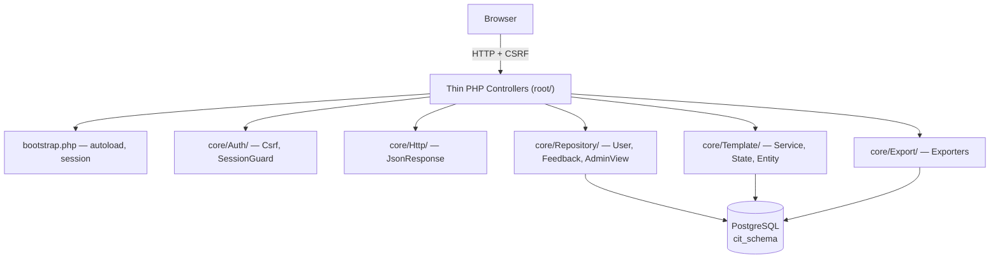

# ИССД — Информационная система сбора данных

Веб-приложение для сбора отчётных данных от муниципальных образований (МО) по настраиваемым шаблонам таблиц. Дипломная работа (ГКУ «ЦИТ Оренбургской области»).

## Стек

| Слой | Технология |
|---|---|
| Backend | PHP 8.2 |
| БД | PostgreSQL 16 (схема `cit_schema`) |
| Драйвер БД | `ext-pgsql` (`pg_query_params`) |
| Экспорт | PhpOffice PhpSpreadsheet 5.1 |
| Frontend | Vanilla JS, Chart.js, Yandex Maps API |
| Окружение | Docker Compose (PHP+Apache, Postgres) |

## Быстрый старт

```bash
docker compose up -d --build
# http://localhost:8000
```

### Тестовые учётки (после загрузки сид-данных)

| Логин | Пароль | Роль | МО |
|---|---|---|---|
| admin | admin | admin | Оренбург |
| minec | admin | minec | Оренбург |
| orenburg | admin | user | Оренбург |
| orsk | admin | user | Орск |
| buzuluk | admin | user | Бузулук |

## Архитектура



### Структура репозитория

```
.
├── bootstrap.php                — единая точка инициализации
├── db.php                       — подключение к PostgreSQL (env vars)
├── auth.php                     — функции-гарды (require_auth/admin/minec)
├── composer.json                — PhpSpreadsheet + classmap на core/
├── docker-compose.yml
├── Dockerfile
├── docker/initdb/               — сиды БД
├── core/
│   ├── Auth/                    — Csrf, SessionGuard
│   ├── Http/                    — JsonResponse
│   ├── Repository/              — User, Feedback, AdminView
│   ├── Template/                — Template (Entity), TemplateService (Facade), TemplateState (State)
│   └── Export/                  — FilledDataExcelExporter, FeedbackExcelExporter
├── login.php, register.php, logout.php,
├── save_table.php, save_template.php,
├── export_excel.php, export_feedback_excel.php,
├── get_table.php, get_municipalities.php,
├── admin_view.php, minec_view.php, index.php,
├── chart_data.php, submit_form.php
├── styles.css, script.js, constructor.js, charts.js
└── docs/superpowers/            — спецификации и планы (для диплома)
```

## ООП-паттерны

| Паттерн | Реализация |
|---|---|
| **Facade** | [`core/Template/TemplateService.php`](core/Template/TemplateService.php) — единая точка доступа ко всем операциям с шаблонами и заполненными данными |
| **State** | [`core/Template/TemplateState.php`](core/Template/TemplateState.php) — Active/Inactive/NoTemplate описывают поведение шаблона |
| **Null Object** | `Template::notFound()` в [`core/Template/Template.php`](core/Template/Template.php) — псевдо-шаблон на случай отсутствия |
| **Repository** | [`core/Repository/`](core/Repository) — инкапсуляция SQL-доступа (User, Feedback, AdminView) |
| **Thin Controller** | Любой файл в корне (`login.php`, `save_template.php` и т.д.) — только wiring, вся логика в `core/` |

## База данных

Init-скрипты лежат в [`docker/initdb/`](docker/initdb) и выполняются автоматически при первом старте Postgres.

| Таблица | Что хранит |
|---|---|
| `municipalities` | Список МО Оренбургской области |
| `users` | Пользователи с ролями (`user`/`admin`/`minec`) |
| `table_templates` | Шаблоны таблиц в JSONB (структура и заголовки) |
| `filled_data` | Заполненные пользователями таблицы (JSONB) |
| `feedback_requests` | Обращения через форму обратной связи |

## Безопасность

### Что закрыто

- **CSRF** — все POST-эндпоинты требуют токен из сессии
- **Session fixation** — `session_regenerate_id(true)` на логине
- **Cookie flags** — `HttpOnly`, `SameSite=Lax` (для прода добавить `Secure=true`)
- **Generic auth errors** — одинаковое сообщение при неверном логине и пароле (не даёт enumerate)
- **SQL injection** — везде `pg_query_params` с плейсхолдерами
- **XSS** — `htmlspecialchars` + `JSON_HEX_TAG` на выводе, `nl2br` только после экранирования
- **Public endpoints** — `get_municipalities.php` требует авторизации

### Зона роста (не входит в scope диплома)

- Rate-limit на `login.php`
- 2FA для admin-роли
- CSP / X-Frame-Options / HSTS заголовки
- Email verification при регистрации
- Password policy (длина, сложность)
- Вынос credentials БД в env с обязательной валидацией (сейчас есть fallback)

## Разработка

```bash
docker compose logs -f php         # логи приложения
docker compose exec postgres psql -U postgres -d postgres   # psql
composer dump-autoload -o          # регенерация autoload после новых классов
```

## Лицензия

Учебный проект, дипломная работа. Не для коммерческого использования.
