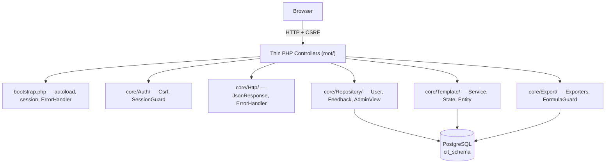

# Diploma Polish Implementation Plan

> **For agentic workers:** REQUIRED SUB-SKILL: Use superpowers:subagent-driven-development (recommended) or superpowers:executing-plans to implement this plan task-by-task. Steps use checkbox (`- [ ]`) syntax for tracking.

**Goal:** Рефакторинг ИССД (PHP/PostgreSQL) за неделю под защиту диплома — OOP-слой в `core/`, тонкие контроллеры, security-минимум, README с Mermaid.

**Architecture:** Процедурные PHP-скрипты в корне становятся тонкими entry-points. Вся логика переезжает в `core/` по доменам: `Auth/`, `Http/`, `Repository/`, `Template/`, `Export/`. Composer classmap autoload убирает `require_once`-цепочки. Один `bootstrap.php` инициализирует сессию, автолоад, обработчик ошибок.

**Tech Stack:** PHP 8.2, PostgreSQL 16, PhpSpreadsheet 5.1, vanilla JS, Composer autoload (classmap), Docker Compose.

**Notes:**
- Тесты отсутствуют в существующем проекте и вне scope (кроме опционального буфера на день 7). Вместо TDD — пошаговая ручная валидация через `docker compose exec` + curl + браузер.
- Работа идёт в git-worktree `.worktrees/refactor-diploma-polish` (ветка `refactor/diploma-polish`), чтобы `main` всегда запускался.
- После каждой задачи — минимальная ручная проверка + коммит.

---

## File Structure

### Новые файлы (`core/`)

| Файл | Ответственность |
|---|---|
| `core/Auth/Csrf.php` | Генерация и проверка CSRF-токена (session-based) |
| `core/Auth/SessionGuard.php` | OOP-обёртка над `require_auth/admin/minec` |
| `core/Http/JsonResponse.php` | Единый формат JSON-ответа |
| `core/Http/ErrorHandler.php` | Глобальный перехват Throwable |
| `core/Repository/UserRepository.php` | Запросы по `users` |
| `core/Repository/FeedbackRepository.php` | Вставка в `feedback_requests` |
| `core/Repository/AdminViewRepository.php` | Выборки для admin/minec view |
| `core/Export/ExcelFormulaGuard.php` | Sanitize значений перед setCellValue |
| `core/Export/FilledDataExcelExporter.php` | Одна заполненная таблица → xlsx |
| `core/Export/FeedbackExcelExporter.php` | Все заявки → xlsx |

### Новые файлы (корень)

| Файл | Ответственность |
|---|---|
| `bootstrap.php` | Autoload, cookie params, session, ErrorHandler, `$conn` |
| `README.md` | Документация + Mermaid-диаграмма |

### Модифицируемые файлы

| Файл | Что делаем |
|---|---|
| `composer.json` | Добавить `autoload.classmap` |
| `.gitignore` | Добавить `.worktrees/` и `vendor/` (если нет) |
| `core/Template/Template.php` | Rename `createEmpty()` → `notFound()`; папка из `core/` → `core/Template/` |
| `core/Template/TemplateService.php` | Atomic `createTemplate`, `canBeUsedForFill` в `saveFilledData` |
| `core/Template/TemplateState.php` | Перемещение в подпапку |
| `login.php`, `register.php`, `logout.php`, `submit_form.php`, `save_table.php`, `save_template.php`, `export_excel.php`, `export_feedback_excel.php`, `get_municipalities.php`, `admin_view.php`, `minec_view.php`, `index.php`, `get_table.php` | Превращаем в тонкие контроллеры |
| `auth.php` | Внутри `session_start()` → соблюдает cookie params из bootstrap |

---

## Day 1 — Foundation (worktree, autoload, bootstrap, base classes)

### Task 1.1: Git worktree и .gitignore

**Files:**
- Modify: `.gitignore` (создать если нет)

- [ ] **Step 1: Проверить, что `.gitignore` закрывает будущую worktree-папку**

```bash
test -f .gitignore && grep -q "^.worktrees/" .gitignore && echo OK || echo MISSING
```

- [ ] **Step 2: Добавить записи в `.gitignore` если их нет**

Содержимое файла `.gitignore` (если создаётся новый):

```
.worktrees/
vendor/
.idea/
.vscode/*
!.vscode/settings.json
*.log
```

- [ ] **Step 3: Коммит gitignore**

```bash
git add .gitignore
git commit -m "chore: add .gitignore with worktrees/vendor entries"
```

- [ ] **Step 4: Создать worktree**

```bash
git worktree add .worktrees/refactor-diploma-polish -b refactor/diploma-polish
cd .worktrees/refactor-diploma-polish
```

- [ ] **Step 5: Установить зависимости в worktree и поднять docker-окружение**

```bash
composer install
docker compose up -d --build
```

Expected: все контейнеры поднимаются, http://localhost:8000 отдаёт HTTP 200.

- [ ] **Step 6: Зафиксировать baseline — проверка что всё ещё работает**

```bash
curl -s -o /dev/null -w "%{http_code}\n" http://localhost:8000/index.php
docker compose exec -T postgres psql -U postgres -d postgres -c "SELECT COUNT(*) FROM cit_schema.users;"
```

Expected: HTTP 200, users count = 6.

---

### Task 1.2: Composer autoload classmap

**Files:**
- Modify: `composer.json`

- [ ] **Step 1: Обновить `composer.json`**

Полное содержимое:

```json
{
    "require": {
        "phpoffice/phpspreadsheet": "^5.1"
    },
    "autoload": {
        "classmap": ["core/"]
    }
}
```

- [ ] **Step 2: Регенерировать автолоад**

```bash
composer dump-autoload
```

Expected: `Generated optimized autoload files containing 0 classes` (нормально, `core/` пока пусто классами).

- [ ] **Step 3: Перенести `core/Template.php`, `core/TemplateService.php`, `core/TemplateState.php` в `core/Template/`**

```bash
mkdir -p core/Template
git mv core/Template.php core/Template/Template.php
git mv core/TemplateService.php core/Template/TemplateService.php
git mv core/TemplateState.php core/Template/TemplateState.php
```

- [ ] **Step 4: Поправить require_once внутри перемещённых файлов**

В `core/Template/TemplateService.php` строка:
```php
require_once __DIR__ . '/Template.php';
```
остаётся как есть (файл теперь в той же папке).

В `core/Template/Template.php` строка:
```php
require_once __DIR__ . '/TemplateState.php';
```
остаётся как есть.

- [ ] **Step 5: Обновить все include в корневых файлах**

В `save_table.php`, `save_template.php`, `export_excel.php`, `admin_view.php`, `minec_view.php`, `get_table.php` заменить:
```php
require_once __DIR__ . '/core/TemplateService.php';
```
на:
```php
require_once __DIR__ . '/core/Template/TemplateService.php';
```

- [ ] **Step 6: Проверить что страницы не сломались**

```bash
curl -s -o /dev/null -w "admin_view:%{http_code}\n" http://localhost:8000/admin_view.php
curl -s -o /dev/null -w "index:%{http_code}\n" http://localhost:8000/index.php
```

Expected: `index:200`, `admin_view:*` (любой код, главное не 500).

- [ ] **Step 7: Коммит**

```bash
git add composer.json core/ save_table.php save_template.php export_excel.php admin_view.php minec_view.php get_table.php
git commit -m "refactor: composer autoload classmap, move Template/* to subfolder"
```

---

### Task 1.3: core/Http/JsonResponse.php

**Files:**
- Create: `core/Http/JsonResponse.php`

- [ ] **Step 1: Создать папку и файл**

```bash
mkdir -p core/Http
```

Содержимое `core/Http/JsonResponse.php`:

```php
<?php

/**
 * Единый формат JSON-ответа для API-эндпоинтов.
 */
final class JsonResponse
{
    /** @param array<string, mixed> $data */
    public static function success(string $message = '', array $data = []): void
    {
        self::send(200, ['success' => true, 'message' => $message] + ($data ? ['data' => $data] : []));
    }

    public static function error(int $statusCode, string $message): void
    {
        self::send($statusCode, ['success' => false, 'message' => $message]);
    }

    /** @param array<string, mixed> $payload */
    private static function send(int $statusCode, array $payload): void
    {
        if (!headers_sent()) {
            http_response_code($statusCode);
            header('Content-Type: application/json; charset=utf-8');
        }
        echo json_encode($payload, JSON_UNESCAPED_UNICODE);
    }
}
```

- [ ] **Step 2: Регенерировать autoload**

```bash
composer dump-autoload
```

Expected: `Generated optimized autoload files containing 1 classes`.

- [ ] **Step 3: Коммит**

```bash
git add core/Http/JsonResponse.php
git commit -m "feat(http): add JsonResponse helper for unified API responses"
```

---

### Task 1.4: core/Http/ErrorHandler.php

**Files:**
- Create: `core/Http/ErrorHandler.php`

- [ ] **Step 1: Создать файл**

Содержимое `core/Http/ErrorHandler.php`:

```php
<?php

/**
 * Глобальный обработчик Throwable.
 * Пишет полный текст в error_log, клиенту отдаёт generic сообщение.
 * В dev-режиме (ENV APP_DEBUG=1) отдаёт детали.
 */
final class ErrorHandler
{
    public static function register(): void
    {
        set_exception_handler([self::class, 'handleException']);
        set_error_handler([self::class, 'handleError']);
    }

    public static function handleException(Throwable $e): void
    {
        error_log(sprintf(
            "[%s] %s in %s:%d\n%s",
            get_class($e),
            $e->getMessage(),
            $e->getFile(),
            $e->getLine(),
            $e->getTraceAsString()
        ));

        $isDebug = getenv('APP_DEBUG') === '1';
        $message = $isDebug
            ? sprintf('%s: %s', get_class($e), $e->getMessage())
            : 'Внутренняя ошибка сервера';

        if (!headers_sent()) {
            http_response_code(500);
            header('Content-Type: application/json; charset=utf-8');
        }
        echo json_encode(['success' => false, 'message' => $message], JSON_UNESCAPED_UNICODE);
    }

    public static function handleError(int $severity, string $message, string $file, int $line): bool
    {
        if (!(error_reporting() & $severity)) {
            return false;
        }
        throw new ErrorException($message, 0, $severity, $file, $line);
    }
}
```

- [ ] **Step 2: Регенерировать autoload**

```bash
composer dump-autoload
```

- [ ] **Step 3: Коммит**

```bash
git add core/Http/ErrorHandler.php
git commit -m "feat(http): add ErrorHandler for Throwable → error_log + generic response"
```

---

### Task 1.5: core/Auth/Csrf.php

**Files:**
- Create: `core/Auth/Csrf.php`

- [ ] **Step 1: Создать файл**

```bash
mkdir -p core/Auth
```

Содержимое `core/Auth/Csrf.php`:

```php
<?php

/**
 * CSRF-токен, хранится в сессии, живёт всю сессию.
 */
final class Csrf
{
    private const SESSION_KEY = '_csrf';
    private const HEADER_NAME = 'X-CSRF-Token';
    private const FORM_FIELD = '_csrf';

    /** Возвращает токен (создаёт при первом обращении). */
    public static function token(): string
    {
        if (empty($_SESSION[self::SESSION_KEY])) {
            $_SESSION[self::SESSION_KEY] = bin2hex(random_bytes(32));
        }
        return $_SESSION[self::SESSION_KEY];
    }

    /** HTML-инпут для форм. */
    public static function input(): string
    {
        return '<input type="hidden" name="' . self::FORM_FIELD . '" value="' . htmlspecialchars(self::token(), ENT_QUOTES) . '">';
    }

    /**
     * Проверяет токен из POST или заголовка X-CSRF-Token.
     * При несовпадении — HTTP 403 и завершает выполнение.
     */
    public static function verifyOrFail(): void
    {
        $expected = self::token();
        $fromPost = $_POST[self::FORM_FIELD] ?? '';
        $fromHeader = $_SERVER['HTTP_X_CSRF_TOKEN'] ?? '';
        $actual = $fromPost !== '' ? $fromPost : $fromHeader;

        if (!is_string($actual) || !hash_equals($expected, $actual)) {
            http_response_code(403);
            header('Content-Type: application/json; charset=utf-8');
            echo json_encode(['success' => false, 'message' => 'Недействительный CSRF-токен.'], JSON_UNESCAPED_UNICODE);
            exit;
        }
    }
}
```

- [ ] **Step 2: Регенерировать autoload**

```bash
composer dump-autoload
```

- [ ] **Step 3: Коммит**

```bash
git add core/Auth/Csrf.php
git commit -m "feat(auth): add Csrf token generator/verifier"
```

---

### Task 1.6: bootstrap.php

**Files:**
- Create: `bootstrap.php`
- Modify: `auth.php` (удаляем `session_start` изнутри `ensure_session_started`, поскольку теперь cookie params задаются до — но оставляем логику совместимости)

- [ ] **Step 1: Создать `bootstrap.php`**

Содержимое `bootstrap.php`:

```php
<?php

/**
 * Единая точка инициализации для всех entry-points.
 * Подключает autoload, настраивает cookie params, стартует сессию,
 * регистрирует обработчик ошибок, устанавливает $conn.
 */

require __DIR__ . '/vendor/autoload.php';

ErrorHandler::register();

if (session_status() === PHP_SESSION_NONE) {
    session_set_cookie_params([
        'lifetime' => 0,
        'path' => '/',
        'httponly' => true,
        'samesite' => 'Lax',
        'secure' => false, // на проде: true (HTTPS only)
    ]);
}

require __DIR__ . '/auth.php';
ensure_session_started();

require __DIR__ . '/db.php';
```

- [ ] **Step 2: Проверить что bootstrap подключается**

```bash
docker compose exec -T php php -r "require '/var/www/html/bootstrap.php'; echo 'bootstrap OK';"
```

Expected: `bootstrap OK` (возможно с JSON об ошибке если $conn не установится — но shell-вывод содержит 'bootstrap OK').

- [ ] **Step 3: Коммит**

```bash
git add bootstrap.php
git commit -m "feat: add bootstrap.php — single entry-point initializer"
```

---

## Day 2 — Repositories + Auth controllers

### Task 2.1: core/Auth/SessionGuard.php

**Files:**
- Create: `core/Auth/SessionGuard.php`

- [ ] **Step 1: Создать файл**

Содержимое `core/Auth/SessionGuard.php`:

```php
<?php

/**
 * OOP-обёртка над существующими require_auth/require_admin/require_minec.
 * Позволяет контроллерам работать через инстанс вместо глобальных функций.
 */
final class SessionGuard
{
    public function requireAuth(): void
    {
        require_auth();
    }

    public function requireAdmin(): void
    {
        require_admin();
    }

    public function requireMinec(): void
    {
        require_minec();
    }

    public function userId(): ?int
    {
        return current_user_id();
    }

    public function role(): string
    {
        return $_SESSION['role'] ?? '';
    }

    public function isAdmin(): bool
    {
        return is_admin();
    }

    public function isMinec(): bool
    {
        return is_minec();
    }

    public function municipalityName(): ?string
    {
        return current_municipality_name();
    }

    public function municipalityId(): ?int
    {
        return isset($_SESSION['municipality_id']) ? (int)$_SESSION['municipality_id'] : null;
    }
}
```

- [ ] **Step 2: Регенерировать autoload и коммит**

```bash
composer dump-autoload
git add core/Auth/SessionGuard.php
git commit -m "feat(auth): add SessionGuard OOP wrapper over auth.php functions"
```

---

### Task 2.2: core/Repository/UserRepository.php

**Files:**
- Create: `core/Repository/UserRepository.php`

- [ ] **Step 1: Создать файл**

```bash
mkdir -p core/Repository
```

Содержимое `core/Repository/UserRepository.php`:

```php
<?php

/**
 * Репозиторий доступа к таблице users.
 */
final class UserRepository
{
    /** @var \PgSql\Connection */
    private $conn;

    public function __construct($conn)
    {
        $this->conn = $conn;
    }

    /**
     * @return array{user_id:int,user_full_name:string,user_password:string,role:string,municipality_id:int,municipality_name:string}|null
     */
    public function findForLoginByLogin(string $login): ?array
    {
        $sql = "
            SELECT u.user_id, u.user_full_name, u.user_password, u.role,
                   u.municipality_id, m.municipality_name
              FROM cit_schema.users u
              JOIN cit_schema.municipalities m ON m.municipality_id = u.municipality_id
             WHERE u.user_login = $1
             LIMIT 1
        ";
        $res = pg_query_params($this->conn, $sql, [$login]);
        if (!$res || !($row = pg_fetch_assoc($res))) {
            return null;
        }
        return [
            'user_id' => (int)$row['user_id'],
            'user_full_name' => (string)$row['user_full_name'],
            'user_password' => (string)$row['user_password'],
            'role' => (string)($row['role'] ?? 'user'),
            'municipality_id' => (int)$row['municipality_id'],
            'municipality_name' => (string)$row['municipality_name'],
        ];
    }

    public function existsByLoginOrEmail(string $login, string $email): bool
    {
        $sql = "SELECT 1 FROM cit_schema.users WHERE user_login = $1 OR user_email = $2 LIMIT 1";
        $res = pg_query_params($this->conn, $sql, [$login, $email]);
        return $res !== false && pg_num_rows($res) > 0;
    }

    public function create(
        string $fullName,
        string $login,
        string $passwordHash,
        string $email,
        string $phone,
        int $municipalityId
    ): void {
        $sql = "
            INSERT INTO cit_schema.users
                (user_full_name, user_login, user_password, user_email, user_phone, municipality_id, is_admin)
            VALUES ($1, $2, $3, $4, $5, $6, false)
        ";
        $res = pg_query_params($this->conn, $sql, [$fullName, $login, $passwordHash, $email, $phone, $municipalityId]);
        if (!$res) {
            throw new RuntimeException('Не удалось создать пользователя.');
        }
    }

    public function findMunicipalityIdByUserId(int $userId): ?int
    {
        $sql = "SELECT municipality_id FROM cit_schema.users WHERE user_id = $1 LIMIT 1";
        $res = pg_query_params($this->conn, $sql, [$userId]);
        if (!$res || pg_num_rows($res) === 0) {
            return null;
        }
        $row = pg_fetch_assoc($res);
        return isset($row['municipality_id']) ? (int)$row['municipality_id'] : null;
    }
}
```

- [ ] **Step 2: Коммит**

```bash
composer dump-autoload
git add core/Repository/UserRepository.php
git commit -m "feat(repo): add UserRepository"
```

---

### Task 2.3: core/Repository/FeedbackRepository.php

**Files:**
- Create: `core/Repository/FeedbackRepository.php`

- [ ] **Step 1: Создать файл**

```php
<?php

/**
 * Репозиторий для feedback_requests.
 */
final class FeedbackRepository
{
    /** @var \PgSql\Connection */
    private $conn;

    public function __construct($conn)
    {
        $this->conn = $conn;
    }

    public function create(?int $userId, string $fullName, string $phone, string $problem): void
    {
        $sql = "
            INSERT INTO cit_schema.feedback_requests
                (user_id, full_name_feedback, phone_feedback, problem_description_feedback)
            VALUES ($1, $2, $3, $4)
        ";
        $res = pg_query_params($this->conn, $sql, [$userId, $fullName, $phone, $problem]);
        if (!$res) {
            throw new RuntimeException('Не удалось сохранить заявку.');
        }
    }

    /** @return array<int, array<string, string>> */
    public function listAll(): array
    {
        $sql = "
            SELECT feedback_id, full_name_feedback, phone_feedback, problem_description_feedback
              FROM cit_schema.feedback_requests
             ORDER BY feedback_id DESC
        ";
        $res = pg_query($this->conn, $sql);
        if (!$res) {
            return [];
        }
        $rows = [];
        while ($row = pg_fetch_assoc($res)) {
            $rows[] = $row;
        }
        return $rows;
    }
}
```

- [ ] **Step 2: Коммит**

```bash
composer dump-autoload
git add core/Repository/FeedbackRepository.php
git commit -m "feat(repo): add FeedbackRepository"
```

---

### Task 2.4: core/Repository/AdminViewRepository.php

**Files:**
- Create: `core/Repository/AdminViewRepository.php`

- [ ] **Step 1: Создать файл** (вынос дубликата из `admin_view.php`/`minec_view.php`)

```php
<?php

/**
 * Репозиторий данных для admin/minec-страниц.
 */
final class AdminViewRepository
{
    /** @var \PgSql\Connection */
    private $conn;

    public function __construct($conn)
    {
        $this->conn = $conn;
    }

    /** @return array<int, array<string, mixed>> */
    public function getFilledTables(): array
    {
        $sql = "
            SELECT f.filled_data_id, f.template_id, f.filled_data,
                   u.user_full_name,
                   m.municipality_id, m.municipality_name,
                   t.template_name, f.filled_date
              FROM cit_schema.filled_data f
              JOIN cit_schema.users u ON f.user_id = u.user_id
              JOIN cit_schema.municipalities m ON f.municipality_id = m.municipality_id
              JOIN cit_schema.table_templates t ON t.template_id = f.template_id
             ORDER BY f.filled_date DESC
        ";
        $res = pg_query($this->conn, $sql);
        if (!$res) {
            return [];
        }
        $rows = [];
        while ($r = pg_fetch_assoc($res)) {
            $rows[] = $r;
        }
        return $rows;
    }

    /** @return array<int, array<string, string>> */
    public function getTemplatesList(): array
    {
        $sql = "SELECT template_id, template_name, is_active FROM cit_schema.table_templates ORDER BY template_id DESC";
        $res = pg_query($this->conn, $sql);
        if (!$res) {
            return [];
        }
        $list = [];
        while ($row = pg_fetch_assoc($res)) {
            $list[] = $row;
        }
        return $list;
    }

    /** @return array<int, array<string, string>> */
    public function getMunicipalitiesList(): array
    {
        $sql = "SELECT municipality_id, municipality_name FROM cit_schema.municipalities ORDER BY municipality_name";
        $res = pg_query($this->conn, $sql);
        if (!$res) {
            return [];
        }
        $list = [];
        while ($row = pg_fetch_assoc($res)) {
            $list[] = $row;
        }
        return $list;
    }
}
```

- [ ] **Step 2: Коммит**

```bash
composer dump-autoload
git add core/Repository/AdminViewRepository.php
git commit -m "feat(repo): extract AdminViewRepository from admin_view/minec_view"
```

---

### Task 2.5: Переписать `login.php` — CSRF, session regen, generic error

**Files:**
- Modify: `login.php` (полный rewrite)

- [ ] **Step 1: Заменить содержимое `login.php`**

```php
<?php

/**
 * Контроллер авторизации.
 * Проверяет CSRF, единое generic-сообщение, регенерирует session_id после успеха.
 */
require_once __DIR__ . '/bootstrap.php';

header('Content-Type: application/json; charset=utf-8');

if (($_SERVER['REQUEST_METHOD'] ?? '') !== 'POST') {
    JsonResponse::error(405, 'Метод не поддерживается.');
    exit;
}

Csrf::verifyOrFail();

$login = trim($_POST['username'] ?? '');
$password = $_POST['password'] ?? '';

if ($login === '' || $password === '') {
    JsonResponse::error(400, 'Введите логин и пароль.');
    exit;
}

$repo = new UserRepository($conn);
$user = $repo->findForLoginByLogin($login);

// Generic сообщение (одинаковое для «нет пользователя» и «неверный пароль»)
$generic = 'Неверный логин или пароль.';

if ($user === null || !password_verify($password, $user['user_password'])) {
    JsonResponse::error(401, $generic);
    exit;
}

// Предотвращаем session fixation
session_regenerate_id(true);

$_SESSION['user_id'] = $user['user_id'];
$_SESSION['user_full_name'] = $user['user_full_name'];
$_SESSION['role'] = $user['role'];
$_SESSION['municipality_id'] = $user['municipality_id'];
$_SESSION['municipality_name'] = $user['municipality_name'];

session_write_close();

$redirect = match ($user['role']) {
    'admin' => 'admin_view.php',
    'minec' => 'minec_view.php',
    default => 'index.php',
};

JsonResponse::success('Вы успешно вошли', ['redirect' => $redirect]);
```

- [ ] **Step 2: Добавить CSRF-токен в форму логина внутри `index.php`**

В файле `index.php` найти строку с формой логина (около строки 146):
```php
<form action="login.php" method="POST">
    <h2>Авторизация</h2>
```

Заменить на:
```php
<form action="login.php" method="POST" class="js-csrf-form">
    <?= Csrf::input() ?>
    <h2>Авторизация</h2>
```

Аналогично для формы регистрации (строка 102):
```php
<form action="register.php" method="POST" class="js-csrf-form">
    <?= Csrf::input() ?>
    <h2>Регистрация</h2>
```

И форма обратной связи (строка 74):
```php
<form id="feedbackForm" method="POST" class="js-csrf-form">
    <?= Csrf::input() ?>
```

Также в начале `index.php` заменить:
```php
<?php
session_start();
include "db.php";
?>
```
на:
```php
<?php
require_once __DIR__ . '/bootstrap.php';
?>
```

- [ ] **Step 3: Проверить логин через curl**

```bash
# 1. Получить CSRF-токен из формы
CSRF=$(curl -s -c /tmp/c.txt http://localhost:8000/index.php | grep -oP 'name="_csrf" value="\K[^"]+' | head -1)
echo "CSRF=$CSRF"

# 2. Попытка логина без CSRF — должен отлупить 403
curl -s -b /tmp/c.txt -X POST http://localhost:8000/login.php \
  -d "username=admin&password=admin"

# 3. Попытка с правильным CSRF — успех
curl -s -b /tmp/c.txt -c /tmp/c.txt -X POST http://localhost:8000/login.php \
  -d "username=admin&password=admin&_csrf=$CSRF"

# 4. Неверный пароль — generic message
curl -s -b /tmp/c.txt -X POST http://localhost:8000/login.php \
  -d "username=admin&password=wrong&_csrf=$CSRF"
```

Expected: шаг 2 — `{"success":false,"message":"Недействительный CSRF-токен."}`. Шаг 3 — `{"success":true,...}`. Шаг 4 — `{"success":false,"message":"Неверный логин или пароль."}`.

- [ ] **Step 4: Коммит**

```bash
git add login.php index.php
git commit -m "refactor(login): CSRF, session regenerate, generic auth error"
```

---

### Task 2.6: Переписать `register.php`

**Files:**
- Modify: `register.php`

- [ ] **Step 1: Заменить содержимое `register.php`**

```php
<?php

/**
 * Контроллер регистрации. CSRF-защищён, скрывает ошибки БД.
 */
require_once __DIR__ . '/bootstrap.php';

header('Content-Type: application/json; charset=utf-8');

if (($_SERVER['REQUEST_METHOD'] ?? '') !== 'POST') {
    JsonResponse::error(405, 'Метод не поддерживается.');
    exit;
}

Csrf::verifyOrFail();

$fullName = trim($_POST['fullname'] ?? '');
$phone = trim($_POST['phone'] ?? '');
$email = trim($_POST['email'] ?? '');
$municipalityId = (int)($_POST['municipality_id'] ?? 0);
$login = trim($_POST['username'] ?? '');
$password = (string)($_POST['password'] ?? '');

if ($fullName === '' || $phone === '' || $email === '' || $municipalityId <= 0 || $login === '' || $password === '') {
    JsonResponse::error(400, 'Все поля обязательны для заполнения.');
    exit;
}

if (!preg_match('/^[А-ЯЁ][а-яё]+(\s[А-ЯЁ][а-яё]+)*$/u', $fullName)) {
    JsonResponse::error(400, 'ФИО должно содержать только буквы и начинаться с заглавной буквы.');
    exit;
}

if (!preg_match('/^\+7\d{10}$/', $phone)) {
    JsonResponse::error(400, 'Телефон должен начинаться с +7 и содержать 11 цифр.');
    exit;
}

if (!filter_var($email, FILTER_VALIDATE_EMAIL)) {
    JsonResponse::error(400, 'Некорректный email.');
    exit;
}

$repo = new UserRepository($conn);

if ($repo->existsByLoginOrEmail($login, $email)) {
    JsonResponse::error(409, 'Пользователь с таким логином или email уже существует.');
    exit;
}

$repo->create(
    $fullName,
    $login,
    password_hash($password, PASSWORD_BCRYPT),
    $email,
    $phone,
    $municipalityId
);

JsonResponse::success('Регистрация успешна!');
```

- [ ] **Step 2: Проверить через curl**

```bash
CSRF=$(curl -s -c /tmp/c.txt http://localhost:8000/index.php | grep -oP 'name="_csrf" value="\K[^"]+' | head -1)

# Попытка регистрации с дубликатом логина
curl -s -b /tmp/c.txt -X POST http://localhost:8000/register.php \
  --data-urlencode "fullname=Тест Тест" \
  --data-urlencode "phone=+79998887766" \
  --data-urlencode "email=admin@example.ru" \
  --data-urlencode "municipality_id=1" \
  --data-urlencode "username=admin" \
  --data-urlencode "password=test" \
  --data-urlencode "_csrf=$CSRF"
```

Expected: `{"success":false,"message":"Пользователь с таким логином или email уже существует."}`.

- [ ] **Step 3: Коммит**

```bash
git add register.php
git commit -m "refactor(register): CSRF, extract to UserRepository, hide DB errors"
```

---

### Task 2.7: Переписать `logout.php`

**Files:**
- Modify: `logout.php`
- Modify: `index.php` (кнопка выхода теперь через форму POST с CSRF)

- [ ] **Step 1: Заменить `logout.php`**

```php
<?php

/**
 * Контроллер выхода. Принимает только POST с CSRF-токеном.
 */
require_once __DIR__ . '/bootstrap.php';

if (($_SERVER['REQUEST_METHOD'] ?? '') !== 'POST') {
    http_response_code(405);
    exit('Метод не поддерживается.');
}

Csrf::verifyOrFail();

$_SESSION = [];
if (ini_get('session.use_cookies')) {
    $params = session_get_cookie_params();
    setcookie(
        session_name(),
        '',
        time() - 42000,
        $params['path'],
        $params['domain'],
        $params['secure'],
        $params['httponly']
    );
}
session_destroy();

header('Location: index.php');
exit;
```

- [ ] **Step 2: Заменить «userCircle → logout» в `index.php`**

В конце `index.php` (блок со скриптом вокруг строки 164-176) заменить содержимое:

```html
<!-- Скрытая форма выхода + JS -->
<form id="logoutForm" method="POST" action="logout.php" style="display:none;">
    <?= Csrf::input() ?>
</form>
<script>
document.addEventListener('DOMContentLoaded', function () {
    const userCircle = document.getElementById('userCircle');
    if (userCircle) {
        userCircle.addEventListener('click', function () {
            if (confirm('Вы хотите выйти из личного кабинета?')) {
                document.getElementById('logoutForm').submit();
            }
        });
    }
});
</script>
```

- [ ] **Step 3: Проверить**

```bash
# GET теперь не работает
curl -s -o /dev/null -w "%{http_code}\n" http://localhost:8000/logout.php

# POST без CSRF — 403
CSRF=$(curl -s -c /tmp/c.txt http://localhost:8000/index.php | grep -oP 'name="_csrf" value="\K[^"]+' | head -1)
curl -s -b /tmp/c.txt -X POST http://localhost:8000/logout.php -d ""
```

Expected: GET → 405. POST без CSRF → `{"success":false,...}` 403.

- [ ] **Step 4: Коммит**

```bash
git add logout.php index.php
git commit -m "refactor(logout): POST-only with CSRF, secure cookie cleanup"
```

---

### Task 2.8: Переписать `submit_form.php`

**Files:**
- Modify: `submit_form.php`

- [ ] **Step 1: Заменить содержимое**

```php
<?php

/**
 * Контроллер формы обратной связи.
 */
require_once __DIR__ . '/bootstrap.php';

header('Content-Type: application/json; charset=utf-8');

if (($_SERVER['REQUEST_METHOD'] ?? '') !== 'POST') {
    JsonResponse::error(405, 'Метод не поддерживается.');
    exit;
}

Csrf::verifyOrFail();

$fullName = trim($_POST['full-name'] ?? '');
$phone = trim($_POST['phone'] ?? '');
$problem = trim($_POST['problem-description'] ?? '');

$errors = [];

if (!preg_match('/^[А-ЯЁ][а-яё]+(\s[А-ЯЁ][а-яё]+)*$/u', $fullName)) {
    $errors[] = 'ФИО должно содержать только буквы и начинаться с заглавной буквы.';
}
if (!preg_match('/^\+7\d{10}$/', $phone)) {
    $errors[] = 'Телефон должен начинаться с +7 и содержать 11 цифр.';
}
if ($problem === '') {
    $errors[] = 'Текст обращения не может быть пустым.';
}

if (!empty($errors)) {
    http_response_code(400);
    echo json_encode(['success' => false, 'errors' => $errors], JSON_UNESCAPED_UNICODE);
    exit;
}

$guard = new SessionGuard();
$repo = new FeedbackRepository($conn);
$repo->create($guard->userId(), $fullName, $phone, $problem);

JsonResponse::success('Заявка успешно отправлена.');
```

- [ ] **Step 2: Проверить**

```bash
CSRF=$(curl -s -c /tmp/c.txt http://localhost:8000/index.php | grep -oP 'name="_csrf" value="\K[^"]+' | head -1)
curl -s -b /tmp/c.txt -X POST http://localhost:8000/submit_form.php \
  --data-urlencode "full-name=Иванов Иван" \
  --data-urlencode "phone=+79998887766" \
  --data-urlencode "problem-description=Тестовое обращение" \
  --data-urlencode "_csrf=$CSRF"
```

Expected: `{"success":true,"message":"Заявка успешно отправлена."}`.

- [ ] **Step 3: Коммит**

```bash
git add submit_form.php
git commit -m "refactor(feedback): CSRF, extract to FeedbackRepository"
```

---

## Day 3 — Template invariants + save_table/save_template

### Task 3.1: Template::notFound() переименование

**Files:**
- Modify: `core/Template/Template.php`
- Modify: `core/Template/TemplateService.php`

- [ ] **Step 1: Найти все вызовы `Template::createEmpty()`**

```bash
grep -rn "Template::createEmpty" core/ *.php
```

- [ ] **Step 2: В `core/Template/Template.php` добавить новый метод, старый оставить как alias**

Открыть `core/Template/Template.php`, после существующего метода `createEmpty()` (строка ~58) добавить:

```php
    /**
     * Null-object для «шаблон не найден». Рекомендуемое имя.
     */
    public static function notFound(): Template
    {
        return self::createEmpty();
    }
```

- [ ] **Step 3: В `core/Template/TemplateService.php` заменить оба вызова `Template::createEmpty()` на `Template::notFound()`**

Файл `core/Template/TemplateService.php`, строки 48 и 82:

```php
return Template::createEmpty();
```
заменить на:
```php
return Template::notFound();
```

- [ ] **Step 4: Коммит**

```bash
git add core/Template/Template.php core/Template/TemplateService.php
git commit -m "refactor(template): rename createEmpty → notFound (semantic clarity)"
```

---

### Task 3.2: TemplateService.createTemplate — атомарная активация

**Files:**
- Modify: `core/Template/TemplateService.php`

- [ ] **Step 1: Заменить метод `createTemplate` в `core/Template/TemplateService.php`**

Заменить весь метод (строки ~107-126):

```php
    public function createTemplate(string $name, array $headers, array $structure, bool $makeActive = false): int
    {
        pg_query($this->conn, 'BEGIN');
        try {
            if ($makeActive) {
                $deactivate = "UPDATE cit_schema.table_templates SET is_active = FALSE WHERE is_active = TRUE";
                if (!pg_query($this->conn, $deactivate)) {
                    throw new RuntimeException('Ошибка деактивации прежнего шаблона: ' . pg_last_error($this->conn));
                }
            }

            $sql = "INSERT INTO cit_schema.table_templates
                        (template_name, template_headers, template_structure, is_active)
                    VALUES ($1, $2::jsonb, $3::jsonb, $4)
                    RETURNING template_id";

            $res = pg_query_params($this->conn, $sql, [
                $name,
                json_encode($headers, JSON_UNESCAPED_UNICODE),
                json_encode($structure, JSON_UNESCAPED_UNICODE),
                $makeActive ? 't' : 'f',
            ]);

            if (!$res) {
                throw new RuntimeException('Ошибка создания шаблона: ' . pg_last_error($this->conn));
            }

            $row = pg_fetch_assoc($res);
            $newId = (int)$row['template_id'];

            pg_query($this->conn, 'COMMIT');
            return $newId;
        } catch (Throwable $e) {
            pg_query($this->conn, 'ROLLBACK');
            throw $e;
        }
    }
```

- [ ] **Step 2: Проверить транзакционность через SQL**

```bash
docker compose exec -T postgres psql -U postgres -d postgres -c "
    SELECT template_id, template_name, is_active FROM cit_schema.table_templates ORDER BY template_id;
"
```

Expected: активен максимум один шаблон (убедиться что текущее состояние нормальное; после теста через UI флаг перейдёт атомарно).

- [ ] **Step 3: Коммит**

```bash
git add core/Template/TemplateService.php
git commit -m "fix(template): createTemplate atomically deactivates previous active"
```

---

### Task 3.3: TemplateService.saveFilledData — canBeUsedForFill

**Files:**
- Modify: `core/Template/TemplateService.php`

- [ ] **Step 1: Заменить метод `saveFilledData`**

```php
    public function saveFilledData(int $userId, int $templateId, int $municipalityId, array $rows): void
    {
        $template = $this->getTemplateById($templateId);
        if (!$template->canBeUsedForFill()) {
            throw new DomainException('Шаблон недоступен для заполнения.');
        }

        $sql = "INSERT INTO cit_schema.filled_data (user_id, template_id, municipality_id, filled_data)
                VALUES ($1, $2, $3, $4::jsonb)";

        $json = json_encode($rows, JSON_UNESCAPED_UNICODE);
        if ($json === false) {
            throw new RuntimeException('Не удалось сериализовать данные таблицы в JSON.');
        }

        $res = pg_query_params($this->conn, $sql, [$userId, $templateId, $municipalityId, $json]);
        if (!$res) {
            throw new RuntimeException('Ошибка сохранения данных таблицы: ' . pg_last_error($this->conn));
        }
    }
```

- [ ] **Step 2: Коммит**

```bash
git add core/Template/TemplateService.php
git commit -m "fix(template): saveFilledData rejects templates that cannot be used for fill"
```

---

### Task 3.4: Переписать `save_template.php`

**Files:**
- Modify: `save_template.php`

- [ ] **Step 1: Заменить содержимое**

```php
<?php

/**
 * Контроллер сохранения шаблона (JSON payload).
 * Только admin, CSRF из заголовка X-CSRF-Token.
 */
require_once __DIR__ . '/bootstrap.php';

header('Content-Type: application/json; charset=utf-8');

if (($_SERVER['REQUEST_METHOD'] ?? '') !== 'POST') {
    JsonResponse::error(405, 'Метод не поддерживается.');
    exit;
}

(new SessionGuard())->requireAdmin();
Csrf::verifyOrFail();

/**
 * Валидатор payload конструктора шаблона.
 */
final class TemplatePayloadValidator
{
    /** @return array{ok:bool,error?:string,name?:string,makeActive?:bool,headers?:array,structure?:array} */
    public function validate(array $data): array
    {
        $name = trim((string)($data['template_name'] ?? ''));
        $makeActive = !empty($data['make_active']);
        $headers = $data['headers'] ?? [];
        $structure = $data['structure'] ?? null;

        if ($name === '') return ['ok' => false, 'error' => 'Название шаблона не может быть пустым.'];
        if (!is_array($headers) || count($headers) === 0) return ['ok' => false, 'error' => 'Должен быть хотя бы один столбец.'];
        if (!is_array($structure) || !isset($structure['rows']) || !is_array($structure['rows'])) {
            return ['ok' => false, 'error' => 'Некорректная структура таблицы.'];
        }

        foreach ($headers as &$h) {
            if (!is_array($h)) return ['ok' => false, 'error' => 'Некорректный заголовок столбца.'];
            $h['name'] = trim((string)($h['name'] ?? ''));
            if ($h['name'] === '') return ['ok' => false, 'error' => 'Имя столбца не может быть пустым.'];
            $h['type'] = (($h['type'] ?? 'text') === 'number') ? 'number' : 'text';
            $h['readonly'] = !empty($h['readonly']);
        }
        unset($h);

        foreach ($structure['rows'] as $row) {
            if (!is_array($row)) return ['ok' => false, 'error' => 'Некорректная строка таблицы.'];
            $rowType = (string)($row['rowType'] ?? 'normal');
            if (!in_array($rowType, ['normal', 'comment'], true)) {
                return ['ok' => false, 'error' => 'Некорректный тип строки.'];
            }
            if (!is_array($row['cells'] ?? [])) return ['ok' => false, 'error' => 'Некорректные ячейки строки.'];
        }

        $merges = $structure['merges'] ?? [];
        if (!is_array($merges)) return ['ok' => false, 'error' => 'Некорректная структура объединений.'];

        foreach ($merges as $merge) {
            if (!is_array($merge) || !isset($merge['startRow'], $merge['startCol'])) {
                return ['ok' => false, 'error' => 'Некорректное объединение ячеек.'];
            }
            $sr = (int)$merge['startRow'];
            $sc = (int)$merge['startCol'];
            $rs = isset($merge['rowSpan']) ? (int)$merge['rowSpan'] : 1;
            $cs = isset($merge['colSpan']) ? (int)$merge['colSpan'] : 1;
            if ($sr < 0 || $sc < 0 || $rs < 1 || $cs < 1) {
                return ['ok' => false, 'error' => 'Некорректные координаты объединения.'];
            }
        }

        return ['ok' => true, 'name' => $name, 'makeActive' => $makeActive, 'headers' => $headers, 'structure' => $structure];
    }
}

$raw = (string)file_get_contents('php://input');
$data = json_decode($raw, true);
if (!is_array($data)) {
    JsonResponse::error(400, 'Некорректный формат данных (ожидается JSON).');
    exit;
}

$validator = new TemplatePayloadValidator();
$check = $validator->validate($data);
if (empty($check['ok'])) {
    JsonResponse::error(400, (string)($check['error'] ?? 'Ошибка валидации.'));
    exit;
}

$service = new TemplateService($conn);
$newId = $service->createTemplate(
    (string)$check['name'],
    (array)$check['headers'],
    (array)$check['structure'],
    (bool)$check['makeActive']
);

$msg = 'Шаблон успешно сохранён (ID=' . $newId . ')' . (!empty($check['makeActive']) ? ' и сделан активным.' : '');
JsonResponse::success($msg, ['template_id' => $newId]);
```

- [ ] **Step 2: Обновить `constructor.js` — добавить заголовок `X-CSRF-Token`**

```bash
grep -n "fetch" constructor.js
```

Найти fetch-вызов сохранения шаблона (типично `fetch('save_template.php', {...})`). В блок `headers` добавить:

```js
headers: {
    'Content-Type': 'application/json',
    'X-CSRF-Token': window.csrfToken || ''
}
```

Токен пробрасывается из PHP (см. Task 5.1).

- [ ] **Step 3: Коммит**

```bash
git add save_template.php constructor.js
git commit -m "refactor(template): CSRF, thin controller, extracted validator"
```

---

### Task 3.5: Переписать `save_table.php`

**Files:**
- Modify: `save_table.php`

- [ ] **Step 1: Заменить содержимое**

```php
<?php

/**
 * Контроллер сохранения заполненной таблицы.
 */
require_once __DIR__ . '/bootstrap.php';

$guard = new SessionGuard();
$guard->requireAuth();

if (($_SERVER['REQUEST_METHOD'] ?? '') !== 'POST') {
    JsonResponse::error(405, 'Метод не поддерживается.');
    exit;
}

Csrf::verifyOrFail();

$userId = $guard->userId();
if ($userId === null) {
    JsonResponse::error(401, 'Необходима авторизация.');
    exit;
}

$templateId = (int)($_POST['template_id'] ?? 0);
$cells = $_POST['cell'] ?? [];

if ($templateId <= 0 || !is_array($cells)) {
    JsonResponse::error(400, 'Неверные данные формы.');
    exit;
}

$userRepo = new UserRepository($conn);
$municipalityId = $userRepo->findMunicipalityIdByUserId($userId);
if ($municipalityId === null) {
    JsonResponse::error(400, 'Не найдено муниципальное образование пользователя.');
    exit;
}

$service = new TemplateService($conn);
$template = $service->getTemplateById($templateId);
$headers = $template->getHeaders();
$structure = $template->getStructure();

/** @var array<string,string> $columnTypes */
$columnTypes = [];
foreach ($headers as $h) {
    $name = (string)($h['name'] ?? '');
    if ($name === '') continue;
    $columnTypes[$name] = (($h['type'] ?? 'text') === 'number') ? 'number' : 'text';
}

/** @var array<int,string> $rowTypes */
$rowTypes = [];
foreach ($structure['rows'] ?? [] as $idx => $rowDef) {
    $rowTypes[(int)$idx] = (is_array($rowDef) && ($rowDef['rowType'] ?? 'normal') === 'comment') ? 'comment' : 'normal';
}

$ok = true;
foreach ($cells as $rIndex => &$row) {
    if (!is_array($row)) continue;
    $rowType = $rowTypes[(int)$rIndex] ?? 'normal';
    foreach ($row as $colName => &$value) {
        $value = trim((string)$value);
        if ($rowType === 'comment') continue;
        $type = $columnTypes[(string)$colName] ?? 'text';
        if ($type === 'text') continue;
        if ($value === '') { $ok = false; continue; }
        $normalized = str_replace(',', '.', $value);
        if (!is_numeric($normalized)) { $ok = false; continue; }
        $value = $normalized;
    }
    unset($value);
}
unset($row);

if (!$ok) {
    JsonResponse::error(400, 'Не все поля заполнены или заполнены некорректно.');
    exit;
}

try {
    $service->saveFilledData($userId, $templateId, $municipalityId, $cells);
} catch (DomainException $e) {
    JsonResponse::error(400, $e->getMessage());
    exit;
}

JsonResponse::success('Данные успешно сохранены.');
```

- [ ] **Step 2: Обновить inline JS в `get_table.php` — добавить CSRF-заголовок в fetch**

Найти в `get_table.php` блок `fetch(this.form.action || "save_table.php", {...})` (около строки 355). Заменить блок `headers` на:

```js
headers: {
    "X-Requested-With": "XMLHttpRequest",
    "Accept": "application/json",
    "X-CSRF-Token": window.csrfToken || ""
}
```

И добавить в `<head>` или перед `<script>` строку (в самом `get_table.php`):
```php
<script>window.csrfToken = <?= json_encode(Csrf::token()) ?>;</script>
```

Также в `<form id="data-form" ...>` добавить `<?= Csrf::input() ?>` сразу после открывающего тега.

- [ ] **Step 3: Коммит**

```bash
git add save_table.php get_table.php
git commit -m "refactor(save-table): CSRF, thin controller, DomainException for bad template"
```

---

## Day 4 — Excel + closed endpoints

### Task 4.1: core/Export/ExcelFormulaGuard.php

**Files:**
- Create: `core/Export/ExcelFormulaGuard.php`

- [ ] **Step 1: Создать файл**

```bash
mkdir -p core/Export
```

```php
<?php

/**
 * Защита от Excel/CSV formula injection.
 * Если значение начинается с опасного символа — префиксуем апострофом.
 */
final class ExcelFormulaGuard
{
    private const DANGEROUS_PREFIXES = ['=', '+', '-', '@', "\t", "\r"];

    public static function sanitize(mixed $value): mixed
    {
        if (!is_string($value) || $value === '') {
            return $value;
        }
        if (in_array($value[0], self::DANGEROUS_PREFIXES, true)) {
            return "'" . $value;
        }
        return $value;
    }
}
```

- [ ] **Step 2: Коммит**

```bash
composer dump-autoload
git add core/Export/ExcelFormulaGuard.php
git commit -m "feat(export): add ExcelFormulaGuard against formula injection"
```

---

### Task 4.2: core/Export/FilledDataExcelExporter.php

**Files:**
- Create: `core/Export/FilledDataExcelExporter.php`

- [ ] **Step 1: Создать файл**

```php
<?php

use PhpOffice\PhpSpreadsheet\Spreadsheet;
use PhpOffice\PhpSpreadsheet\Writer\Xlsx;
use PhpOffice\PhpSpreadsheet\Style\Alignment;
use PhpOffice\PhpSpreadsheet\Style\Border;
use PhpOffice\PhpSpreadsheet\Cell\Coordinate;

/**
 * Экспорт одной заполненной таблицы в xlsx по шаблону.
 */
final class FilledDataExcelExporter
{
    /** @var \PgSql\Connection */
    private $conn;
    private TemplateService $service;

    public function __construct($conn, TemplateService $service)
    {
        $this->conn = $conn;
        $this->service = $service;
    }

    public function export(int $filledId): void
    {
        $sql = "
            SELECT f.filled_data, f.filled_date, f.template_id,
                   u.user_full_name, m.municipality_name
              FROM cit_schema.filled_data f
              JOIN cit_schema.users u ON u.user_id = f.user_id
              JOIN cit_schema.municipalities m ON m.municipality_id = f.municipality_id
             WHERE f.filled_data_id = $1
        ";
        $res = pg_query_params($this->conn, $sql, [$filledId]);
        if (!$res || pg_num_rows($res) === 0) {
            throw new RuntimeException('Нет данных для выгрузки.');
        }
        $row = pg_fetch_assoc($res);

        $data = json_decode($row['filled_data'] ?? '[]', true);
        if (!is_array($data)) {
            throw new RuntimeException('Ошибка декодирования JSON данных.');
        }

        $template = $this->service->getTemplateById((int)$row['template_id']);
        $headers = $template->getHeaders();
        $structure = $template->getStructure();
        $rowDefs = $structure['rows'] ?? [];
        $merges = $structure['merges'] ?? [];

        $columnsCount = count($headers);
        if ($columnsCount === 0) {
            throw new RuntimeException('В шаблоне нет заголовков колонок.');
        }

        $rowTypes = [];
        foreach ($rowDefs as $idx => $rowDef) {
            $rowTypes[$idx] = (is_array($rowDef) && ($rowDef['rowType'] ?? 'normal') === 'comment') ? 'comment' : 'normal';
        }

        $spreadsheet = new Spreadsheet();
        $sheet = $spreadsheet->getActiveSheet();
        $sheet->setTitle('Отчёт');

        $firstCol = Coordinate::stringFromColumnIndex(1);
        $lastCol = Coordinate::stringFromColumnIndex($columnsCount);

        $sheet->mergeCells($firstCol . '1:' . $lastCol . '1');
        $sheet->setCellValue($firstCol . '1', ExcelFormulaGuard::sanitize($template->getName()));
        $sheet->getStyle($firstCol . '1')->getAlignment()
            ->setHorizontal(Alignment::HORIZONTAL_CENTER)
            ->setVertical(Alignment::VERTICAL_CENTER)
            ->setWrapText(true);
        $sheet->getStyle($firstCol . '1')->getFont()->setBold(true);

        $sheet->mergeCells($firstCol . '2:' . $lastCol . '2');
        $sheet->setCellValue(
            $firstCol . '2',
            ExcelFormulaGuard::sanitize("МО: {$row['municipality_name']}   Дата: {$row['filled_date']}")
        );
        $sheet->getStyle($firstCol . '2')->getAlignment()
            ->setHorizontal(Alignment::HORIZONTAL_CENTER)
            ->setVertical(Alignment::VERTICAL_CENTER);

        $headerRow = 4;
        foreach ($headers as $index => $h) {
            $colLetter = Coordinate::stringFromColumnIndex($index + 1);
            $sheet->setCellValue($colLetter . $headerRow, ExcelFormulaGuard::sanitize($h['name']));
        }

        $dataStartRow = $headerRow + 1;
        $currentRow = $dataStartRow;

        foreach ($rowDefs as $rIndex => $rowDef) {
            if (is_array($rowDef) && isset($rowDef['rowType'], $rowDef['cells']) && is_array($rowDef['cells'])) {
                $rowType = $rowDef['rowType'];
                $cellsMeta = $rowDef['cells'];
            } else {
                $rowType = 'normal';
                $cellsMeta = is_array($rowDef) ? $rowDef : [];
            }

            $userRow = $data[$rIndex] ?? [];
            if (!is_array($userRow)) $userRow = [];

            if ($rowType === 'comment') {
                $comment = $userRow['Комментарий'] ?? ($cellsMeta['Комментарий'] ?? '');
                $sheet->mergeCells($firstCol . $currentRow . ':' . $lastCol . $currentRow);
                $sheet->setCellValue($firstCol . $currentRow, ExcelFormulaGuard::sanitize($comment));
            } else {
                foreach ($headers as $index => $h) {
                    $colLetter = Coordinate::stringFromColumnIndex($index + 1);
                    $name = $h['name'];
                    $value = $userRow[$name] ?? ($cellsMeta[$name] ?? '');
                    $sheet->setCellValue($colLetter . $currentRow, ExcelFormulaGuard::sanitize($value));
                }
            }
            $currentRow++;
        }

        if (is_array($merges)) {
            foreach ($merges as $merge) {
                if (!is_array($merge)) continue;
                $sr = (int)($merge['startRow'] ?? 0);
                $sc = (int)($merge['startCol'] ?? 0);
                $rs = (int)($merge['rowSpan'] ?? 1);
                $cs = (int)($merge['colSpan'] ?? 1);
                if ($sr < 0 || $sc < 0 || $rs < 1 || $cs < 1) continue;

                $hasCommentRow = false;
                for ($r = $sr; $r <= $sr + $rs - 1; $r++) {
                    if (($rowTypes[$r] ?? 'normal') === 'comment') { $hasCommentRow = true; break; }
                }
                if ($hasCommentRow) continue;

                $excelRowStart = $dataStartRow + $sr;
                $excelRowEnd = $excelRowStart + $rs - 1;
                $excelColStart = Coordinate::stringFromColumnIndex($sc + 1);
                $excelColEnd = Coordinate::stringFromColumnIndex($sc + $cs);
                $sheet->mergeCells($excelColStart . $excelRowStart . ':' . $excelColEnd . $excelRowEnd);
            }
        }

        $styleArray = [
            'borders' => ['allBorders' => ['borderStyle' => Border::BORDER_THIN]],
            'alignment' => [
                'horizontal' => Alignment::HORIZONTAL_CENTER,
                'vertical' => Alignment::VERTICAL_CENTER,
                'wrapText' => true,
            ],
        ];
        $sheet->getStyle($firstCol . $headerRow . ':' . $lastCol . ($currentRow - 1))->applyFromArray($styleArray);
        $sheet->getStyle($firstCol . $headerRow . ':' . $lastCol . $headerRow)->getFont()->setBold(true);

        for ($i = 1; $i <= $columnsCount; $i++) {
            $sheet->getColumnDimension(Coordinate::stringFromColumnIndex($i))->setAutoSize(true);
        }

        $filename = "filled_data_{$filledId}.xlsx";
        if (ob_get_length()) ob_clean();
        header('Content-Type: application/vnd.openxmlformats-officedocument.spreadsheetml.sheet');
        header("Content-Disposition: attachment; filename=\"$filename\"");
        header('Cache-Control: max-age=0');

        (new Xlsx($spreadsheet))->save('php://output');
    }
}
```

- [ ] **Step 2: Коммит**

```bash
composer dump-autoload
git add core/Export/FilledDataExcelExporter.php
git commit -m "feat(export): extract FilledDataExcelExporter with FormulaGuard"
```

---

### Task 4.3: core/Export/FeedbackExcelExporter.php

**Files:**
- Create: `core/Export/FeedbackExcelExporter.php`

- [ ] **Step 1: Создать файл**

```php
<?php

use PhpOffice\PhpSpreadsheet\Spreadsheet;
use PhpOffice\PhpSpreadsheet\Writer\Xlsx;

/**
 * Экспорт всех заявок обратной связи в xlsx.
 */
final class FeedbackExcelExporter
{
    private FeedbackRepository $repo;

    public function __construct(FeedbackRepository $repo)
    {
        $this->repo = $repo;
    }

    public function export(): void
    {
        $rows = $this->repo->listAll();

        $spreadsheet = new Spreadsheet();
        $sheet = $spreadsheet->getActiveSheet();

        $columns = ['ID', 'ФИО', 'Телефон', 'Текст обращения'];
        foreach ($columns as $col => $name) {
            $sheet->setCellValue(chr(65 + $col) . '1', $name);
        }

        $rowNum = 2;
        foreach ($rows as $row) {
            $sheet->setCellValue('A' . $rowNum, ExcelFormulaGuard::sanitize($row['feedback_id']));
            $sheet->setCellValue('B' . $rowNum, ExcelFormulaGuard::sanitize($row['full_name_feedback']));
            $sheet->setCellValue('C' . $rowNum, ExcelFormulaGuard::sanitize($row['phone_feedback']));
            $sheet->setCellValue('D' . $rowNum, ExcelFormulaGuard::sanitize($row['problem_description_feedback']));
            $rowNum++;
        }

        $filename = 'feedback_requests.xlsx';
        if (ob_get_length()) ob_clean();
        header('Content-Type: application/vnd.openxmlformats-officedocument.spreadsheetml.sheet');
        header("Content-Disposition: attachment; filename=\"$filename\"");
        header('Cache-Control: max-age=0');

        (new Xlsx($spreadsheet))->save('php://output');
    }
}
```

- [ ] **Step 2: Коммит**

```bash
composer dump-autoload
git add core/Export/FeedbackExcelExporter.php
git commit -m "feat(export): extract FeedbackExcelExporter with FormulaGuard"
```

---

### Task 4.4: Тонкий `export_excel.php`

**Files:**
- Modify: `export_excel.php`

- [ ] **Step 1: Заменить содержимое**

```php
<?php

require_once __DIR__ . '/bootstrap.php';

$guard = new SessionGuard();
if (!$guard->isAdmin() && !$guard->isMinec()) {
    http_response_code(403);
    exit('Доступ запрещён');
}

$filledId = (int)($_GET['filled_id'] ?? 0);
if ($filledId <= 0) {
    http_response_code(400);
    exit('Не передан filled_id.');
}

$exporter = new FilledDataExcelExporter($conn, new TemplateService($conn));
$exporter->export($filledId);
exit;
```

- [ ] **Step 2: Проверить скачивание**

```bash
# Логинимся как admin и сохраняем cookies
CSRF=$(curl -s -c /tmp/c.txt http://localhost:8000/index.php | grep -oP 'name="_csrf" value="\K[^"]+' | head -1)
curl -s -b /tmp/c.txt -c /tmp/c.txt -X POST http://localhost:8000/login.php \
  -d "username=admin&password=admin&_csrf=$CSRF"

# Скачиваем xlsx (проверяем что возвращается бинарник)
curl -s -b /tmp/c.txt -o /tmp/test.xlsx "http://localhost:8000/export_excel.php?filled_id=1"
file /tmp/test.xlsx
```

Expected: `test.xlsx: Microsoft OOXML` или `Zip archive data` — значит файл xlsx.

- [ ] **Step 3: Коммит**

```bash
git add export_excel.php
git commit -m "refactor(export): export_excel.php → thin controller"
```

---

### Task 4.5: Тонкий `export_feedback_excel.php`

**Files:**
- Modify: `export_feedback_excel.php`

- [ ] **Step 1: Заменить содержимое**

```php
<?php

require_once __DIR__ . '/bootstrap.php';

$guard = new SessionGuard();
if (!$guard->isAdmin() && !$guard->isMinec()) {
    http_response_code(403);
    exit('Доступ запрещён');
}

(new FeedbackExcelExporter(new FeedbackRepository($conn)))->export();
exit;
```

**Важно:** старый код проверял `$_SESSION['is_admin']`, которого в сессии нет (auth.php пишет `role`). Это был скрытый баг — эндпоинт никогда не пускал. Теперь фикс.

- [ ] **Step 2: Коммит**

```bash
git add export_feedback_excel.php
git commit -m "refactor(export): export_feedback_excel.php → thin controller + fix broken auth check"
```

---

### Task 4.6: Переписать `get_municipalities.php` — auth + JSON + bootstrap

**Files:**
- Modify: `get_municipalities.php`
- Modify: `index.php` (форма регистрации теперь подгружает МО на клиенте через fetch или серверно из `$conn`; выбираем серверный рендер т.к. уже есть)

- [ ] **Step 1: Заменить содержимое `get_municipalities.php`**

```php
<?php

require_once __DIR__ . '/bootstrap.php';

(new SessionGuard())->requireAuth();

header('Content-Type: application/json; charset=utf-8');

$res = pg_query($conn, 'SELECT municipality_id, municipality_name FROM cit_schema.municipalities ORDER BY municipality_name');
if (!$res) {
    JsonResponse::error(500, 'Ошибка загрузки данных.');
    exit;
}

$list = [];
while ($row = pg_fetch_assoc($res)) {
    $list[] = ['id' => (int)$row['municipality_id'], 'name' => $row['municipality_name']];
}

JsonResponse::success('', ['municipalities' => $list]);
```

- [ ] **Step 2: Проверить что `index.php` не использует старый HTML-эндпоинт** (форма регистрации рендерит МО прямо в PHP — это уже серверный рендер, `get_municipalities.php` использовался где-то ещё?)

```bash
grep -rn "get_municipalities" *.php *.js
```

Если есть использование — заменить на fetch к новому JSON-endpoint, либо удалить запрос (форма регистрации уже получает список через PHP).

- [ ] **Step 3: Проверить что endpoint закрыт без авторизации**

```bash
curl -s -o /dev/null -w "%{http_code}\n" http://localhost:8000/get_municipalities.php
```

Expected: 403 (или 302 на index через require_auth — любой не-200 код доступа).

- [ ] **Step 4: Коммит**

```bash
git add get_municipalities.php
git commit -m "refactor(municipalities): require auth, JSON response, use bootstrap"
```

---

## Day 5 — Views + consistency pass

### Task 5.1: Переписать `admin_view.php` с `AdminViewRepository` из `core/`

**Files:**
- Modify: `admin_view.php` (удалить inline-класс `AdminViewRepository`, использовать из `core/`)

- [ ] **Step 1: Заменить начало файла**

```php
<?php

require_once __DIR__ . '/bootstrap.php';

$guard = new SessionGuard();
$guard->requireAdmin();

$service = new TemplateService($conn);
$repo = new AdminViewRepository($conn);

$filledRowsForJs = $repo->getFilledTables();
$templatesList = $repo->getTemplatesList();
$municipalitiesList = $repo->getMunicipalitiesList();
$feedbackRepo = new FeedbackRepository($conn);
$feedbackRows = $feedbackRepo->listAll();

$loadedTemplateArray = null;
if (!empty($_GET['template_id'])) {
    $tplId = (int)$_GET['template_id'];
    if ($tplId > 0) {
        $tpl = $service->getTemplateById($tplId);
        if ($tpl->getId() !== 0) {
            $loadedTemplateArray = [
                'headers' => $tpl->getHeaders(),
                'structure' => $tpl->getStructure(),
                'template_name' => $tpl->getName(),
                'template_id' => $tpl->getId(),
            ];
        }
    }
}
?>
<!DOCTYPE html>
<html lang="ru">
<head>
    <meta charset="UTF-8">
    <title>Администратор - отчеты и шаблоны</title>
    <link rel="stylesheet" href="styles.css">
    <script src="https://cdn.jsdelivr.net/npm/chart.js"></script>
    <script>
        window.initialTemplate = <?= $loadedTemplateArray ? json_encode($loadedTemplateArray, JSON_UNESCAPED_UNICODE | JSON_HEX_TAG | JSON_HEX_APOS | JSON_HEX_AMP | JSON_HEX_QUOT) : 'null' ?>;
        window.municipalitiesList = <?= json_encode($municipalitiesList, JSON_UNESCAPED_UNICODE | JSON_HEX_TAG | JSON_HEX_APOS | JSON_HEX_AMP | JSON_HEX_QUOT) ?>;
        window.filledRowsForJs = <?= json_encode($filledRowsForJs, JSON_UNESCAPED_UNICODE | JSON_HEX_TAG | JSON_HEX_APOS | JSON_HEX_AMP | JSON_HEX_QUOT) ?>;
        window.csrfToken = <?= json_encode(Csrf::token()) ?>;
    </script>
    <script src="constructor.js" defer></script>
</head>
<body class="admin-body">
```

- [ ] **Step 2: Заменить цикл рендера feedback**

Найти блок `<?php if ($feedbackResult): ?>` и заменить на:

```php
<?php if (!empty($feedbackRows)): ?>
    <?php foreach ($feedbackRows as $fb): ?>
        <tr>
            <td><?= htmlspecialchars((string)$fb['feedback_id']) ?></td>
            <td><?= htmlspecialchars((string)$fb['full_name_feedback']) ?></td>
            <td><?= htmlspecialchars((string)$fb['phone_feedback']) ?></td>
            <td><?= nl2br(htmlspecialchars((string)$fb['problem_description_feedback'])) ?></td>
        </tr>
    <?php endforeach; ?>
<?php else: ?>
    <tr><td colspan="4">Нет данных обратной связи</td></tr>
<?php endif; ?>
```

- [ ] **Step 3: Удалить inline-определения классов `AdminViewRepository` и `AdminViewPage`**

Из тела файла удалить всё между `/** Репозиторий... */` и `?>` перед HTML (строки ~20-228 в оригинале).

- [ ] **Step 4: Ручная проверка через браузер**

Войти admin/admin, открыть http://localhost:8000/admin_view.php — список заполненных таблиц виден, конструктор грузится, аналитика рисуется.

- [ ] **Step 5: Коммит**

```bash
git add admin_view.php
git commit -m "refactor(admin-view): use core/Repository/AdminViewRepository, thin controller"
```

---

### Task 5.2: Переписать `minec_view.php`

**Files:**
- Modify: `minec_view.php`

- [ ] **Step 1: Прочитать остаток файла и применить аналогичный паттерн**

```bash
grep -n "?>" minec_view.php | head -5
```

Обрезать inline-классы, оставить вверху:

```php
<?php

require_once __DIR__ . '/bootstrap.php';

$guard = new SessionGuard();
$guard->requireMinec();

$repo = new AdminViewRepository($conn);
$filledRowsForJs = $repo->getFilledTables();
$municipalitiesList = $repo->getMunicipalitiesList();
?>
```

Далее — HTML-часть как была в оригинале (только шапка страницы и JS с переменными `window.filledRowsForJs`/`window.municipalitiesList`), удалить блок с `AdminViewRepository` class definition.

- [ ] **Step 2: Проверить через браузер**

Войти minec/admin → открыть minec_view.php → список видимых таблиц.

- [ ] **Step 3: Коммит**

```bash
git add minec_view.php
git commit -m "refactor(minec-view): use core/Repository/AdminViewRepository, thin controller"
```

---

### Task 5.3: Consistency pass — заменить все `session_start()` на `ensure_session_started()`

**Files:**
- Modify: все PHP-файлы, где остался `session_start()` не в `auth.php`

- [ ] **Step 1: Найти оставшиеся вхождения**

```bash
grep -rn "session_start()" *.php
```

Expected: после Days 1-4 должно остаться только в `auth.php` (внутри `ensure_session_started`).

- [ ] **Step 2: Исправить найденное**

Если найдены — заменить на `require_once __DIR__ . '/bootstrap.php';` и убрать прямой `session_start()`. В частности проверить `chart_data.php`.

- [ ] **Step 3: Привести `chart_data.php` к bootstrap**

```php
<?php

require_once __DIR__ . '/bootstrap.php';

$guard = new SessionGuard();
if (!$guard->isAdmin() && !$guard->isMinec()) {
    JsonResponse::error(403, 'Доступ запрещён');
    exit;
}

$filledId = (int)($_GET['filled_id'] ?? 0);
if ($filledId <= 0) {
    JsonResponse::error(400, 'Не передан filled_id');
    exit;
}

$sql = "
    SELECT f.filled_data, f.filled_date, f.template_id,
           t.template_name, t.template_headers, m.municipality_name
      FROM cit_schema.filled_data f
      JOIN cit_schema.table_templates t ON t.template_id = f.template_id
      JOIN cit_schema.municipalities m ON m.municipality_id = f.municipality_id
     WHERE f.filled_data_id = $1
     LIMIT 1
";
$res = pg_query_params($conn, $sql, [$filledId]);
if (!$res || pg_num_rows($res) === 0) {
    JsonResponse::error(404, 'Данные не найдены');
    exit;
}

$row = pg_fetch_assoc($res);
JsonResponse::success('', [
    'template_name' => $row['template_name'],
    'municipality_name' => $row['municipality_name'],
    'filled_date' => $row['filled_date'],
    'headers' => json_decode($row['template_headers'] ?? '[]', true) ?? [],
    'filled_data' => json_decode($row['filled_data'] ?? '[]', true) ?? [],
]);
```

- [ ] **Step 4: Проверить что все include/require переведены**

```bash
grep -rn "^include " *.php
```

Заменить `include "db.php";` на `require_once __DIR__ . '/bootstrap.php';` во всех entry-point скриптах где это ещё осталось.

- [ ] **Step 5: Коммит**

```bash
git add -A
git commit -m "refactor: consistency pass — bootstrap.php everywhere, no direct session_start"
```

---

### Task 5.4: Полная ручная валидация — E2E scenario файл

**Files:**
- Create: `swarm-report/diploma-polish-e2e-scenario.md`

- [ ] **Step 1: Создать файл сценария**

```bash
mkdir -p swarm-report
```

```markdown
# E2E Scenario: diploma-polish

Платформы: Backend (curl) + Frontend (manual browser)

## Шаги

### A. Гость → регистрация → логин
- [ ] 1. Открыть http://localhost:8000, увидеть кнопку «Войти»
- [ ] 2. Нажать «Войти» → «Регистрация», заполнить валидно → получить «Регистрация успешна»
- [ ] 3. Переключиться на «Войти», ввести новые креды → редирект на index.php

### B. Админ → конструктор → активация
- [ ] 4. Выйти, войти admin/admin → редирект на admin_view.php
- [ ] 5. В конструкторе создать шаблон из 3 колонок → Сохранить → получить alert с ID
- [ ] 6. Поставить галку «Сделать активным» → Сохранить → в dropdown шаблонов он отмечен как активный
- [ ] 7. SQL-проверка: в cit_schema.table_templates активен ровно один

### C. Пользователь МО → заполнение
- [ ] 8. Выйти, войти orenburg/admin → редирект на index.php
- [ ] 9. Открыть «Заполнить форму» → видим активный шаблон
- [ ] 10. Заполнить числовые ячейки → Сохранить → alert «Данные успешно сохранены»
- [ ] 11. SQL: в cit_schema.filled_data новая запись с JSON

### D. Минэк → экспорт
- [ ] 12. Выйти, войти minec/admin → редирект на minec_view.php
- [ ] 13. В списке — только что залитая запись, нажать «Выгрузить в Excel»
- [ ] 14. Скачался xlsx, открывается без ошибок, данные корректны

### E. Feedback
- [ ] 15. Со страницы index.php (любая роль) отправить заявку обратной связи → «Заявка успешно отправлена»
- [ ] 16. Админ → admin_view.php → в списке обратной связи новая запись
- [ ] 17. Кнопка «Выгрузить все заявки в Excel» — скачивается xlsx

### F. Security smoke
- [ ] 18. POST /login.php без CSRF → 403
- [ ] 19. Неверный пароль → generic «Неверный логин или пароль»
- [ ] 20. GET /get_municipalities.php без сессии → 302/403 (не 200)
- [ ] 21. GET /logout.php → 405
```

- [ ] **Step 2: Прогнать сценарий вручную + curl, отметить `[x]` по мере прохождения**

- [ ] **Step 3: Коммит**

```bash
git add swarm-report/diploma-polish-e2e-scenario.md
git commit -m "docs(e2e): add manual validation scenario"
```

---

## Day 6 — README + Mermaid

### Task 6.1: README.md

**Files:**
- Create: `README.md`

- [ ] **Step 1: Создать `README.md`**

```markdown
# ИССД — Информационная система сбора данных

Веб-приложение для сбора отчётных данных от муниципальных образований (МО) по настраиваемым шаблонам таблиц. Дипломная работа (ГКУ «ЦИТ Оренбургской области»).

## Стек

| Слой | Технология |
|---|---|
| Backend | PHP 8.2 |
| БД | PostgreSQL 16 (схема `cit_schema`) |
| Драйвер БД | `ext-pgsql` (pg_query_params) |
| Экспорт | PhpOffice PhpSpreadsheet 5.1 |
| Frontend | Vanilla JS, Chart.js, Yandex Maps API |
| Окружение | Docker Compose (PHP+Apache, Postgres) |

## Быстрый старт

```bash
docker compose up -d --build
# http://localhost:8000
```

### Тестовые учётки (после загрузки сид-данных)

| Логин | Пароль | Роль | МО |
|---|---|---|---|
| admin | admin | admin | Оренбург |
| minec | admin | minec | Оренбург |
| orenburg | admin | user | Оренбург |
| orsk | admin | user | Орск |
| buzuluk | admin | user | Бузулук |

## Архитектура



### Структура репозитория

```
.
├── bootstrap.php                — единая точка инициализации
├── db.php                       — подключение к PostgreSQL
├── auth.php                     — функции-гарды (require_auth/admin/minec)
├── composer.json                — PhpSpreadsheet + classmap на core/
├── docker-compose.yml
├── Dockerfile
├── docker/initdb/               — сиды БД
├── core/
│   ├── Auth/                    — Csrf, SessionGuard
│   ├── Http/                    — JsonResponse, ErrorHandler
│   ├── Repository/              — User, Feedback, AdminView
│   ├── Template/                — Template (Entity), TemplateService (Facade), TemplateState (State)
│   └── Export/                  — ExcelFormulaGuard, FilledDataExcelExporter, FeedbackExcelExporter
├── login.php, register.php, logout.php,
├── save_table.php, save_template.php,
├── export_excel.php, export_feedback_excel.php,
├── get_table.php, get_municipalities.php,
├── admin_view.php, minec_view.php, index.php,
├── chart_data.php, submit_form.php
├── styles.css, script.js, constructor.js, charts.js
└── docs/superpowers/            — спецификации и планы (для диплома)
```

## ООП-паттерны

| Паттерн | Реализация |
|---|---|
| **Facade** | [`core/Template/TemplateService.php`](core/Template/TemplateService.php) — единая точка доступа ко всем операциям с шаблонами и заполненными данными |
| **State** | [`core/Template/TemplateState.php`](core/Template/TemplateState.php) — Active/Inactive/NoTemplate описывают поведение шаблона |
| **Null Object** | `Template::notFound()` в [`core/Template/Template.php`](core/Template/Template.php) — псевдо-шаблон на случай отсутствия |
| **Repository** | [`core/Repository/`](core/Repository) — инкапсуляция SQL-доступа (User, Feedback, AdminView) |
| **Thin Controller** | Любой файл в корне (`login.php`, `save_template.php` и т.д.) — только wiring, вся логика в `core/` |

## База данных

Init-скрипты лежат в [`docker/initdb/`](docker/initdb) и выполняются автоматически при первом старте Postgres.

| Таблица | Что хранит |
|---|---|
| `municipalities` | Список МО Оренбургской области |
| `users` | Пользователи с ролями (`user`/`admin`/`minec`) |
| `table_templates` | Шаблоны таблиц в JSONB (структура и заголовки) |
| `filled_data` | Заполненные пользователями таблицы (JSONB) |
| `feedback_requests` | Обращения через форму обратной связи |

## Безопасность

### Что закрыто

- **CSRF** — все POST-эндпоинты требуют токен из сессии
- **Session fixation** — `session_regenerate_id(true)` на логине
- **Cookie flags** — `HttpOnly`, `SameSite=Lax` (для прода добавить `Secure=true`)
- **Generic auth errors** — одинаковое сообщение при неверном логине и пароле (не даёт enumerate)
- **Generic server errors** — ошибки БД и исключения пишутся в `error_log`, клиенту уходит generic
- **SQL injection** — везде `pg_query_params` с плейсхолдерами
- **XSS** — `htmlspecialchars` + `JSON_HEX_TAG` на выводе, `nl2br` только после экранирования
- **Excel formula injection** — `ExcelFormulaGuard::sanitize()` перед `setCellValue`
- **Public endpoints** — `get_municipalities.php` требует авторизации

### Зона роста (не входит в scope диплома)

- Rate-limit на `login.php`
- 2FA для admin-роли
- CSP / X-Frame-Options / HSTS заголовки
- Email verification при регистрации
- Password policy (длина, сложность)
- Вынос credentials БД в env с обязательной валидацией (сейчас есть fallback)

## Разработка

```bash
docker compose logs -f php         # логи приложения
docker compose exec postgres psql -U postgres -d postgres   # psql
composer dump-autoload             # регенерация autoload после новых классов
```

## Лицензия

Учебный проект, дипломная работа. Не для коммерческого использования.
```

- [ ] **Step 2: Проверить рендер Mermaid локально**

```bash
grep -n "```mermaid" README.md
```

Expected: одна находка (или сколько добавлено). Открыть README.md на GitHub после push для финальной проверки.

- [ ] **Step 3: Коммит**

```bash
git add README.md
git commit -m "docs: add README with architecture Mermaid diagram and pattern navigation"
```

---

### Task 6.2: Финальная валидация — прогон всего сценария

**Files:**
- Use: `swarm-report/diploma-polish-e2e-scenario.md`

- [ ] **Step 1: Перезапустить docker-окружение с чистой БД**

```bash
docker compose down -v
docker compose up -d --build
# ждать, пока postgres станет healthy
sleep 10
docker compose ps
```

- [ ] **Step 2: Пройти все 21 пункт из `swarm-report/diploma-polish-e2e-scenario.md`**

Отмечать каждый пункт `[x]` по мере прохождения.

- [ ] **Step 3: Если какой-то шаг не прошёл — задокументировать, вернуться к задаче, исправить, повторить**

- [ ] **Step 4: Коммит финального состояния сценария**

```bash
git add swarm-report/diploma-polish-e2e-scenario.md
git commit -m "test(e2e): pass all 21 scenario steps manually"
```

---

## Day 7 — Буфер / полировка

### Task 7.1: Приёмочные правки

Зависит от того, что найдёшь на валидации / что попросит пользователь. Типовые кандидаты:
- Улучшение визуала Mermaid-диаграммы
- Правка опечаток в README
- Добавление CLAUDE.md ссылки в README
- 1-2 показательных юнит-теста (опционально, см. 7.2)

### Task 7.2 (опционально): PHPUnit-тест для TemplateService

Если есть время — создать `tests/TemplateServiceTest.php`, установить PHPUnit, показать покрытие одной-двух чистых функций. Конкретный шаг:

- [ ] **Step 1: Добавить dev-зависимость**

```bash
docker compose exec -T php composer require --dev phpunit/phpunit ^11
```

- [ ] **Step 2: Создать `phpunit.xml`**

```xml
<?xml version="1.0"?>
<phpunit bootstrap="vendor/autoload.php" colors="true">
    <testsuites>
        <testsuite name="unit">
            <directory>tests</directory>
        </testsuite>
    </testsuites>
</phpunit>
```

- [ ] **Step 3: `tests/ExcelFormulaGuardTest.php`**

```php
<?php
use PHPUnit\Framework\TestCase;

final class ExcelFormulaGuardTest extends TestCase
{
    public function testSanitizesEqualsPrefix(): void
    {
        $this->assertSame("'=SUM(A1:A10)", ExcelFormulaGuard::sanitize('=SUM(A1:A10)'));
    }

    public function testLeavesSafeStringsUntouched(): void
    {
        $this->assertSame('Обычный текст', ExcelFormulaGuard::sanitize('Обычный текст'));
        $this->assertSame(42, ExcelFormulaGuard::sanitize(42));
    }

    public function testHandlesAllDangerousPrefixes(): void
    {
        foreach (['=', '+', '-', '@', "\t", "\r"] as $prefix) {
            $this->assertSame("'{$prefix}x", ExcelFormulaGuard::sanitize($prefix . 'x'));
        }
    }
}
```

- [ ] **Step 4: Запустить**

```bash
docker compose exec -T php ./vendor/bin/phpunit
```

Expected: 3 теста OK.

- [ ] **Step 5: Коммит**

```bash
git add tests/ phpunit.xml composer.json composer.lock
git commit -m "test: add PHPUnit + ExcelFormulaGuardTest as showcase"
```

### Task 7.3: Merge в main

- [ ] **Step 1: Merge ветки `refactor/diploma-polish` в `main`**

Из основного каталога проекта (НЕ worktree):
```bash
cd ~/Projects/cifra/cifra
git fetch --all
git merge --no-ff refactor/diploma-polish -m "refactor: diploma polish — core/, CSRF, security baseline, README"
```

- [ ] **Step 2: Удалить worktree**

```bash
git worktree remove .worktrees/refactor-diploma-polish
git worktree prune
```

- [ ] **Step 3: Финальный smoke-тест на main**

```bash
docker compose down -v && docker compose up -d --build
curl -s -o /dev/null -w "%{http_code}\n" http://localhost:8000/index.php
```

Expected: 200.

---

## Acceptance Criteria (для защиты диплома)

К концу Day 6:

- [ ] `docker compose up -d --build` поднимает всё без ошибок, `curl -I http://localhost:8000/index.php` → 200
- [ ] Все 21 шаг из `swarm-report/diploma-polish-e2e-scenario.md` отмечены `[x]`
- [ ] В `core/` ≥ 10 классов в организованной структуре
- [ ] В PHP-скриптах в корне нет inline классов репозиториев (только wiring)
- [ ] README.md открывается на GitHub, Mermaid рендерится
- [ ] `grep -rn "session_start()" *.php` возвращает только `auth.php`
- [ ] Все формы имеют `Csrf::input()`, все POST-контроллеры — `Csrf::verifyOrFail()`
- [ ] Login с неверными кредами отдаёт одно generic сообщение
- [ ] `get_municipalities.php` без сессии → не 200
- [ ] Все `setCellValue` в `core/Export/*` проходят через `ExcelFormulaGuard::sanitize`
- [ ] В `README.md` есть секция «Паттерны» с ссылками на файлы
- [ ] В `README.md` есть секция «Безопасность / Зона роста»
