# Диаграмма кооперации — Cifra

Основной сценарий: **пользователь МО заполняет активный шаблон таблицы**.
Параллельно показаны ветки админа (конструктор шаблонов) и Минэка (просмотр).

```mermaid
flowchart LR
    User([Пользователь МО])
    Admin([Администратор])
    Minec([Минэк])

    Index[index.php<br/>лендинг+модалки]
    Register[register.php]
    Login[login.php]
    Auth[auth.php<br/>сессия+гарды]
    GetTable[get_table.php]
    SaveTable[save_table.php]
    AdminView[admin_view.php<br/>+ constructor.js]
    SaveTpl[save_template.php]
    MinecView[minec_view.php]
    Export[export_excel.php]

    TplSvc[[core/TemplateService]]
    DB[(PostgreSQL<br/>cit_schema)]

    %% --- Регистрация / вход ---
    User -- "1.1 регистрация()" --> Index
    Index -- "1.2 POST form" --> Register
    Register -- "1.3 INSERT users" --> DB

    User -- "2.1 login()" --> Index
    Index -- "2.2 POST username/password" --> Login
    Login -- "2.3 SELECT user+municipality" --> DB
    Login -- "2.4 password_verify()" --> Login
    Login -- "2.5 session_start<br/>role→redirect" --> Auth

    %% --- Заполнение таблицы (роль user) ---
    Auth -- "3.1 require_auth()" --> GetTable
    GetTable -- "3.2 getActiveTemplate()" --> TplSvc
    TplSvc -- "3.3 SELECT table_templates<br/>WHERE is_active" --> DB
    User -- "3.4 заполняет форму" --> GetTable
    GetTable -- "3.5 POST JSON" --> SaveTable
    SaveTable -- "3.6 saveFilledData()" --> TplSvc
    TplSvc -- "3.7 INSERT filled_data (JSONB)" --> DB

    %% --- Админ: конструктор шаблонов ---
    Admin -- "4.1 login→admin" --> Login
    Auth -- "4.2 require_admin()" --> AdminView
    Admin -- "4.3 конструирует шаблон" --> AdminView
    AdminView -- "4.4 POST headers+structure" --> SaveTpl
    SaveTpl -- "4.5 createTemplate()<br/>setActiveTemplate()" --> TplSvc
    TplSvc -- "4.6 BEGIN;<br/>снять is_active с остальных;<br/>INSERT+активация" --> DB

    %% --- Минэк: агрегированный просмотр ---
    Minec -- "5.1 login→minec" --> Login
    Auth -- "5.2 require_minec()" --> MinecView
    MinecView -- "5.3 SELECT filled_data JOIN municipalities" --> DB
    Minec -- "5.4 экспорт()" --> Export
    Export -- "5.5 PhpSpreadsheet → xlsx" --> Minec

    classDef entry fill:#f3e8ff,stroke:#7e22ce,color:#000;
    classDef core  fill:#dbeafe,stroke:#1d4ed8,color:#000;
    classDef db    fill:#fef3c7,stroke:#b45309,color:#000;
    class Index,Register,Login,Auth,GetTable,SaveTable,AdminView,SaveTpl,MinecView,Export entry;
    class TplSvc core;
    class DB db;
```

## Легенда нумерации

- **1.x** — регистрация нового пользователя МО
- **2.x** — авторизация
- **3.x** — основной сценарий: заполнение активного шаблона
- **4.x** — админский флоу: конструктор и активация шаблона (транзакционно)
- **5.x** — роль Минэк: агрегированный просмотр + выгрузка в Excel

## Ключевые инварианты (отражены на диаграмме)

- Все защищённые скрипты проходят через `auth.php` (`require_auth` / `require_admin` / `require_minec`).
- Работа с шаблонами и заполненными данными идёт **только** через фасад `core/TemplateService` — прямых SELECT/INSERT по `table_templates` / `filled_data` из скриптов-страниц нет.
- Активация шаблона — транзакционная операция (снимает `is_active` у всех остальных).
