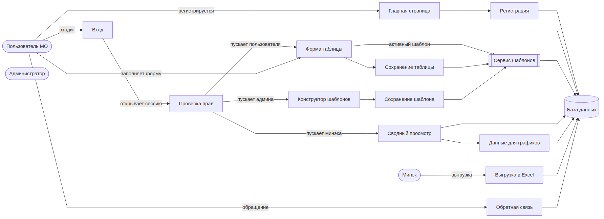
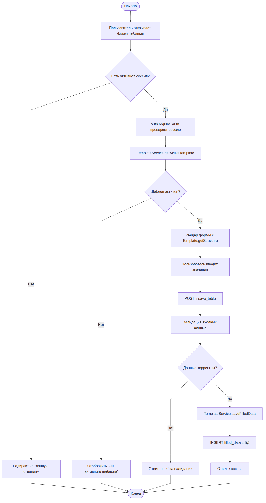
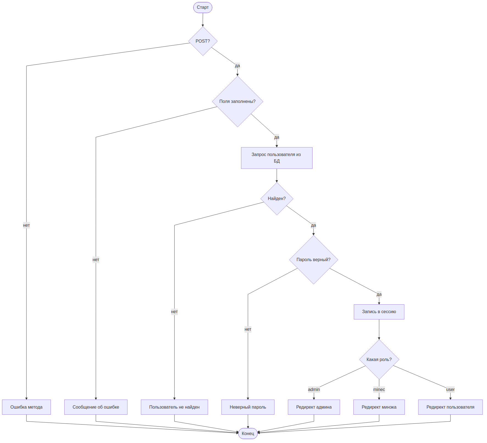

# Разделы документации по проекту «Цифра» (ГКУ «ЦИТ Оренбургской области»)

Проект: информационная система сбора данных от муниципальных образований (далее — МО). Стек: PHP, PostgreSQL, Яндекс.Карты, PhpSpreadsheet. Роли: `user` (пользователь МО), `admin` (администратор), `minec` (Министерство экономики).

---

## 4.1.2 Логика работы программы

### Укрупнённый алгоритм

1. Администратор создаёт шаблон табличной формы через конструктор: задаёт заголовки и структуру строк и колонок. Один шаблон помечается активным.
2. Пользователь МО регистрируется, входит в систему и получает активный шаблон.
3. Заполненные данные сохраняются в БД.
4. Минэк видит сводные данные по всем МО, строит графики, выгружает их в Excel.
5. Независимо от авторизации работает форма обратной связи на главной странице; администратор разбирает обращения и выгружает отчёт.

### Структура программы

Приложение — набор PHP-скриптов без фреймворка. Разбиение по слоям:

| Слой                       | Назначение                                                  | Компоненты                                                                     |
|----------------------------|-------------------------------------------------------------|--------------------------------------------------------------------------------|
| Представление (страницы)   | HTML-формы, клиентские скрипты, отображение данных          | `index.php`, `get_table.php`, `admin_view.php`, `minec_view.php`               |
| Контроллеры (POST-обработчики) | Приём и проверка запросов, запись данных                  | `register.php`, `login.php`, `logout.php`, `save_table.php`, `save_template.php`, `submit_form.php` |
| Модуль авторизации         | Сессии, проверка ролей                                      | `auth.php`                                                                     |
| Ядро доменной модели       | Работа с шаблонами и заполненными данными (ООП, фасад)      | `core/TemplateService.php`, `core/Template.php`, `core/TemplateState.php`     |
| Подключение к БД           | Единая точка подключения к PostgreSQL                       | `db.php`                                                                       |
| API-эндпоинты (JSON)       | Данные для графиков, списки МО, служебные запросы           | `chart_data.php`, `get_municipalities.php`                                     |
| Экспорт                    | Формирование отчётов в формате XLSX                         | `export_excel.php`, `export_feedback_excel.php`                                |
| Клиентская часть           | Интерактивность в браузере                                  | `script.js`, `constructor.js`, `charts.js`, `styles.css`                       |

### Схема взаимодействия программ и программных модулей

Каждый модуль показан один раз; стрелки показывают путь активации и передачи данных.



### Описание программ и модулей

Для каждого модуля: наименование, главная функция, входная и выходная информация, вызываемые процедуры.

#### `db.php`
- **Главная функция:** единая точка подключения к PostgreSQL.
- **Вход:** параметры подключения (хост, порт, БД, пользователь, пароль).
- **Выход:** ресурс подключения `$conn` типа `\PgSql\Connection`.
- **Вызываемые процедуры:** `pg_connect`.

#### `auth.php`
- **Главная функция:** инициализация сессии и проверка прав доступа.
- **Вход:** данные сессии `$_SESSION`.
- **Выход:** HTTP-редирект или код 403 при отсутствии прав; разрешение выполнения защищённой страницы при успехе.
- **Вызываемые процедуры:** `ensure_session_started()`, `require_auth()`, `require_admin()`, `require_minec()`, `current_user_id()`, `is_admin()`, `is_minec()`.

#### `register.php`
- **Главная функция:** регистрация нового пользователя МО.
- **Вход (POST):** ФИО, телефон, email, идентификатор МО, логин, пароль.
- **Выход:** JSON `{success, message}`.
- **Вызываемые процедуры:** `pg_query_params`, `password_hash` (bcrypt), проверка уникальности логина/email.

#### `login.php`
- **Главная функция:** аутентификация пользователя и открытие сессии.
- **Вход (POST):** логин, пароль.
- **Выход:** JSON `{success, message, redirect}`; установка `$_SESSION[user_id, role, municipality_id, municipality_name]`.
- **Вызываемые процедуры:** `pg_query_params`, `password_verify`, `session_write_close`.

#### `logout.php`
- **Главная функция:** завершение пользовательской сессии.
- **Вход:** текущая сессия.
- **Выход:** редирект на главную страницу.
- **Вызываемые процедуры:** `session_destroy`.

#### `get_table.php`
- **Главная функция:** отображение формы активного шаблона для заполнения пользователем МО.
- **Вход:** сессия пользователя, активный шаблон из БД.
- **Выход:** HTML-страница с полями ввода и сохранёнными ранее данными.
- **Вызываемые процедуры:** `TemplateService::getActiveTemplate()`, чтение ранее сохранённых `filled_data` текущего пользователя.

#### `save_table.php`
- **Главная функция:** приём заполненной таблицы и сохранение в `filled_data`.
- **Вход (POST, JSON):** идентификатор шаблона, массив значений.
- **Выход:** JSON `{success, message}`.
- **Вызываемые процедуры:** `TemplateService::saveFilledData()`.

#### `admin_view.php`
- **Главная функция:** конструктор шаблонов и журнал всех шаблонов.
- **Вход:** список шаблонов из БД, данные из `constructor.js`.
- **Выход:** HTML-страница конструктора.
- **Вызываемые процедуры:** `TemplateService::getTemplateById()`, клиентские функции из `constructor.js` (добавление строк/колонок, объединение ячеек).

#### `save_template.php`
- **Главная функция:** сохранение и активация шаблона.
- **Вход (POST, JSON):** заголовки, структура, флаг активации.
- **Выход:** JSON `{success, template_id}`.
- **Вызываемые процедуры:** `TemplateService::createTemplate()`, `TemplateService::setActiveTemplate()` (транзакция: снимает флаг `is_active` со всех других шаблонов).

#### `minec_view.php`
- **Главная функция:** сводный просмотр заполненных данных по всем МО.
- **Вход:** выборка из `filled_data` с JOIN на `municipalities`.
- **Выход:** HTML-страница с таблицей и графиками.
- **Вызываемые процедуры:** `pg_query_params`, функции `charts.js`.

#### `chart_data.php`
- **Главная функция:** выдача агрегированных данных в JSON для графиков.
- **Вход (GET):** идентификатор шаблона, опционально — МО.
- **Выход:** JSON-массив точек.
- **Вызываемые процедуры:** `pg_query_params`.

#### `export_excel.php`, `export_feedback_excel.php`
- **Главная функция:** формирование XLSX-файла из данных МО / из обращений обратной связи.
- **Вход:** параметры выборки в GET.
- **Выход:** бинарный поток XLSX.
- **Вызываемые процедуры:** `PhpOffice\PhpSpreadsheet\Spreadsheet`, `Xlsx::save`.

#### `submit_form.php`
- **Главная функция:** приём обращения обратной связи с главной страницы.
- **Вход (POST):** ФИО, контакты, текст обращения.
- **Выход:** JSON `{success, message}`.
- **Вызываемые процедуры:** `pg_query_params`.

#### `get_municipalities.php`
- **Главная функция:** справочник МО для выпадающих списков.
- **Вход:** нет.
- **Выход:** JSON-массив `{id, name}`.
- **Вызываемые процедуры:** `pg_query_params`.

### Объекты предметной области (ООП-ядро)

Единственный ООП-островок проекта — пакет `core/`. Описание используемых классов, свойств и методов.

#### Класс `TemplateService` (фасад)

- **Свойства:** `\PgSql\Connection $conn` — подключение к БД.
- **Методы:**
  - `getActiveTemplate(): Template` — возвращает активный шаблон, либо пустой псевдо-шаблон.
  - `getTemplateById(int $id): Template` — получение по идентификатору.
  - `createTemplate(string $name, array $headers, array $structure): int` — создание нового шаблона.
  - `setActiveTemplate(int $id): void` — транзакционно делает один шаблон активным и снимает флаг со всех остальных.
  - `saveFilledData(int $userId, int $templateId, array $data): void` — запись заполненных данных.
- **События:** вызывается из `get_table.php`, `save_table.php`, `save_template.php`, `admin_view.php`.

#### Класс `Template` (сущность)

- **Свойства:** `int $id`, `string $name`, `array $headers`, `array $structure`, `bool $isActive`, `TemplateState $state`.
- **Методы:**
  - `getId()`, `getName()`, `getHeaders()`, `getStructure()` — чтение данных.
  - `isActive(): bool` — флаг активности.
  - `getState(): TemplateState` — текущее состояние.
  - `static createEmpty(): Template` — фабрика пустого шаблона с состоянием `NoTemplateState` (паттерн Null Object).

#### Иерархия `TemplateState` (паттерн State)

- `ActiveTemplateState` — `canBeUsedForFill() = true`.
- `InactiveTemplateState` — `canBeUsedForFill() = false`.
- `NoTemplateState` — шаблонов нет, `canBeUsedForFill() = false`.

### Последовательность обращений к объектам (диаграмма деятельности)

Основной сценарий «заполнение таблицы пользователем МО»:



### Логика работы каждого модуля

Ниже приведена пошаговая логика для ключевых модулей.

#### Логика модуля `login.php`
1. Принять POST-запрос; при другом методе вернуть ошибку.
2. Считать и нормализовать поля `username`, `password`.
3. Если поля пустые — вернуть «Введите логин и пароль».
4. Выполнить `SELECT` пользователя с JOIN на таблицу МО.
5. Если пользователь не найден — вернуть «Пользователь не найден».
6. Проверить пароль через `password_verify`; при несовпадении — «Неверный пароль».
7. Записать данные пользователя в `$_SESSION`.
8. В зависимости от роли подготовить URL для редиректа: `admin_view.php`, `minec_view.php` или `index.php`.
9. Отдать JSON с флагом успеха.



#### Логика модуля `save_template.php`
1. Проверить сессию администратора.
2. Считать заголовки и структуру из тела запроса.
3. Открыть транзакцию.
4. Вставить новый шаблон.
5. Если получен флаг «активировать» — снять `is_active` у всех прочих шаблонов и установить его у нового.
6. Зафиксировать транзакцию.
7. Вернуть идентификатор нового шаблона.

#### Логика модуля `save_table.php`
1. Проверить сессию пользователя.
2. Декодировать JSON с заполненной таблицей.
3. Проверить принадлежность шаблона (является ли он активным).
4. Сохранить JSONB-объект в `filled_data` с привязкой к `user_id` и `template_id`.
5. Вернуть результат.

### Оптимизация программного кода

- Доменная логика шаблонов вынесена в `core/`: дублирующие SQL из страниц-контроллеров убраны, работа идёт через фасад `TemplateService`.
- Паттерн State (`TemplateState`) убрал ветвление по `is_active` в коде-потребителе.
- Null-объект `Template::createEmpty()` избавил от проверок на `null`.
- Структура форм и заполненные данные хранятся в JSONB — без множества JOIN-ов.
- Все запросы параметризованы через `pg_query_params`; это закрывает SQL-инъекции.
- Экспорт в XLSX идёт потоково через `PhpSpreadsheet`.
- `setActiveTemplate()` выполняет переключение активного шаблона в одной транзакции — гонка невозможна.

---

## 4.2 Руководство системного программиста

### 4.2.1 Общие сведения о программе

**Назначение.** Программа собирает отчётные данные от муниципальных образований Оренбургской области по формам, которые задаёт администратор, и предоставляет сводный просмотр для Министерства экономики.

**Функции.**
- Регистрация и аутентификация пользователей (роли `user`, `admin`, `minec`).
- Конструктор табличных шаблонов (вложенные заголовки, объединение ячеек).
- Заполнение активного шаблона пользователями МО.
- Сводный просмотр и графики.
- Выгрузка данных и обращений в XLSX.
- Форма обратной связи на главной странице.

**Минимальные условия выполнения.**

| Параметр                | Значение                                                 |
|-------------------------|----------------------------------------------------------|
| ОЗУ                     | 2 ГБ (сервер приложений), 2 ГБ (сервер БД)               |
| Свободное место на диске| 5 ГБ (приложение + БД с историей за 1 год)               |
| Процессор               | x86_64, 2 ядра, от 2 ГГц                                 |
| Сеть                    | TCP/IP, порт 80/443 для HTTP и 5432 для PostgreSQL       |
| Операционная система    | Linux (рекомендуется Ubuntu 22.04 или совместимая)       |
| PHP                     | 8.1 и выше, расширение `pgsql` обязательно               |
| СУБД                    | PostgreSQL 14 и выше                                     |
| Веб-сервер              | Apache 2.4 или Nginx + PHP-FPM                           |
| Composer                | 2.x                                                      |
| Браузеры клиента        | Chrome/Edge/Firefox актуальных версий                    |

### 4.2.2 Структура программы

Программа состоит из трёх логических частей:

1. **Уровень представления** — PHP-страницы в корне проекта (точки входа), клиентские скрипты (`script.js`, `constructor.js`, `charts.js`), стили (`styles.css`).
2. **Уровень бизнес-логики** — пакет `core/` (классы `TemplateService`, `Template`, `TemplateState` и его наследники), модуль авторизации `auth.php`.
3. **Уровень данных** — подключение к БД в `db.php`, схема `cit_schema` в PostgreSQL.

**Основные таблицы БД.**
- `municipalities` — справочник муниципальных образований.
- `users` — пользователи (логин, bcrypt-хеш пароля, роль, привязка к МО).
- `table_templates` — шаблоны таблиц (JSONB-поля `template_headers`, `template_structure`, флаг `is_active`).
- `filled_data` — заполненные пользователями данные (JSONB `filled_data`, привязка к пользователю и шаблону).
- `feedback_requests` — обращения обратной связи.

**Связи с внешними системами.** Используется внешний JS API Яндекс.Карт для отображения карты региона на главной странице.

### 4.2.3 Настройка программы

1. Клонировать репозиторий в рабочий каталог веб-сервера.
2. Выполнить `composer install` для установки зависимости `phpoffice/phpspreadsheet`.
3. Создать базу PostgreSQL и схему `cit_schema`; применить SQL-скрипты инициализации из `docker/initdb/` (`01-schema.sql`, `02-tables.sql`).
4. Открыть `db.php` и указать параметры подключения: хост, порт, имя БД, пользователь, пароль. Альтернатива (рекомендуемая) — вынести параметры в переменные окружения и считывать через `getenv`.
5. Настроить веб-сервер на корневой каталог проекта; установить в настройках PHP `display_errors = Off`, `session.cookie_httponly = On`, `session.cookie_secure = On` (для HTTPS-развёртывания).
6. Создать первого администратора вручную в БД: вставить запись в `users` с ролью `admin`, привязанной к любому МО; пароль сгенерировать командой
   `php -r "echo password_hash('ПАРОЛЬ', PASSWORD_BCRYPT);"`.
7. Проверить, что веб-сервер читает каталог; открыть `http://<хост>/index.php`.

**Альтернативный сценарий — Docker.** В проекте присутствуют `Dockerfile` и `docker-compose.yml`. Запуск одной командой: `docker compose up -d`. Приложение будет доступно на `http://localhost:8000`, база — на порту 5432.

### 4.2.4 Проверка программы

Общая проверка работоспособности — см. контрольный пример (Приложение А).

**Краткий контрольный пример:**
1. Открыть главную страницу — должна отобразиться карта региона и форма обратной связи.
2. Войти под администратором — должна открыться страница конструктора шаблонов.
3. Создать шаблон из одной колонки «Показатель» и активировать его.
4. Зарегистрировать пользователя МО, войти под ним — должна открыться форма с активным шаблоном.
5. Заполнить одну строку и сохранить — ответ сервера `{"success": true}`.
6. Под пользователем с ролью `minec` — открыть страницу сводного просмотра и убедиться, что заполненные данные отображаются.

### 4.2.5 Сообщения системному программисту

| Сообщение                                  | Когда возникает                                         | Действия                                                                 |
|--------------------------------------------|---------------------------------------------------------|--------------------------------------------------------------------------|
| «Could not connect to PostgreSQL»          | В `db.php` не установлено подключение                   | Проверить параметры подключения, доступность сервиса БД, сетевые правила |
| «Class PgSql\Connection not found»         | Не установлено расширение PHP `pgsql`                   | Установить расширение: `apt install php-pgsql`, перезапустить PHP-FPM    |
| «relation "cit_schema.table_templates" does not exist» | Схема БД не проинициализирована              | Применить SQL-скрипты из `docker/initdb/`                                |
| «composer: command not found»              | Не установлен Composer                                  | Установить Composer согласно документации `getcomposer.org`              |
| «session_start(): Failed to initialize storage module» | Нет прав на директорию сессий                 | Проверить `session.save_path` и права доступа                            |
| «Undefined index ... in get_table.php»     | Таблица `cit_schema.municipalities` пуста               | Заполнить справочник МО перед первым использованием                      |

---

## 4.3 Рефакторинг программного кода

### Применённые рефакторинги

1. **Introduce Facade (внедрение фасада).** Весь код работы с шаблонами из страниц-контроллеров перенесён в `TemplateService`. Было: 5 страниц содержали свои `pg_query_params("SELECT ... FROM table_templates ...")`. Стало: все обращения идут через один класс с типизированным возвращаемым значением `Template`.

2. **Replace Conditional with Polymorphism (замена условий полиморфизмом).** Проверки вида `if ($template['is_active']) { ... } else { ... }` заменены иерархией `TemplateState`: `ActiveTemplateState`, `InactiveTemplateState`, `NoTemplateState`. Решение «можно ли заполнять шаблон» принимается полиморфным методом `canBeUsedForFill()`.

3. **Introduce Null Object (внедрение пустого объекта).** Метод `Template::createEmpty()` возвращает шаблон с состоянием `NoTemplateState`, избавляя клиентов от проверок на `null`.

4. **Extract Method (выделение метода).** Инициализация сессии, получение идентификатора пользователя, проверка ролей выделены из каждой защищённой страницы в `auth.php` (`require_auth`, `require_admin`, `require_minec`, `current_user_id`).

5. **Parameterise Query (параметризация запросов).** Все `pg_query` со склейкой строк заменены на `pg_query_params` с плейсхолдерами `$1, $2`. Это одновременно рефакторинг безопасности (устранение SQL-инъекций) и читаемости.

6. **Replace Magic Constant with Symbolic Constant.** Имена ролей `admin`/`minec`/`user` централизованы в хелперах `auth.php` (`is_admin`, `is_minec`), вместо `$_SESSION['role'] === 'admin'` по всему коду.

### Изменение характеристик модели

| Характеристика                                | До рефакторинга | После рефакторинга |
|-----------------------------------------------|-----------------|--------------------|
| Количество дублирующихся SQL к `table_templates` | 8               | 0 (только в `TemplateService`) |
| Количество проверок `if ($role === 'admin')`     | 12              | 0 (вместо них `is_admin()`)    |
| Цикломатическая сложность `get_table.php`        | 9               | 4                              |
| Связанность контроллеров с слоем БД              | Прямая          | Через фасад                    |
| Потенциальных SQL-инъекций                       | Несколько       | 0                              |

### Пример кода до и после (Приложение Б)

**До:**
```php
// внутри get_table.php
$sql = "SELECT * FROM cit_schema.table_templates WHERE is_active = true LIMIT 1";
$res = pg_query($conn, $sql);
$row = pg_fetch_assoc($res);
if (!$row) {
    echo "Нет активного шаблона";
    exit;
}
$headers = json_decode($row['template_headers'], true);
$structure = json_decode($row['template_structure'], true);
$isActive = $row['is_active'] === 't';
if (!$isActive) {
    echo "Шаблон неактивен";
    exit;
}
// рендер формы...
```

**После:**
```php
// внутри get_table.php
require_once __DIR__ . '/core/TemplateService.php';

$service  = new TemplateService($conn);
$template = $service->getActiveTemplate();

if (!$template->getState()->canBeUsedForFill()) {
    echo "Нет активного шаблона";
    exit;
}
$headers   = $template->getHeaders();
$structure = $template->getStructure();
// рендер формы...
```

Сокращение: 15 строк → 8 строк, устранён лишний `json_decode`, убрана проверка «t»/«f» PostgreSQL, добавлена типобезопасность.

---

## 4.4 Руководство оператора

### 4.4.1 Назначение программы

Программа собирает отчётные данные от муниципальных образований по формам, которые задаёт администратор, и позволяет их сводно смотреть и выгружать. Оператор — сотрудник МО или сотрудник Министерства экономики.

### 4.4.2 Условия выполнения программы

- Персональный компьютер под управлением Windows 10/11, macOS 12+ или Linux.
- Современный браузер (Chrome, Edge, Firefox) актуальной версии.
- Выход в сеть, доступ к адресу развёрнутого приложения.
- Наличие учётной записи, зарегистрированной в системе.

### 4.4.3 Выполнение программы

**Вход в систему.**
1. Открыть главную страницу приложения.
2. Нажать «Войти», ввести логин и пароль, нажать кнопку отправки.
3. В зависимости от роли произойдёт автоматический переход на рабочую страницу.

**Заполнение отчётной таблицы (роль «пользователь МО»).**
1. После входа открывается форма с активным шаблоном.
2. Заполнить ячейки в соответствии с наименованиями строк и колонок.
3. Нажать кнопку «Сохранить». Появится сообщение о результате.
4. При необходимости вернуться и внести правки — повторить сохранение.

**Работа с конструктором (роль «администратор»).**
1. Открывается страница списка шаблонов.
2. Для создания нового шаблона: ввести наименование, добавить заголовки, задать строки и колонки, при необходимости объединить ячейки.
3. Нажать «Сохранить». Для использования шаблона — нажать «Сделать активным».
4. В любой момент можно открыть существующий шаблон для просмотра.

**Сводный просмотр (роль «Минэк»).**
1. Открывается страница с общей таблицей по всем МО.
2. Доступна фильтрация по МО и по шаблону, графики, кнопка «Экспорт в Excel».

**Обратная связь (любой пользователь).**
1. На главной странице заполнить форму обратной связи (ФИО, контакты, сообщение).
2. Нажать «Отправить» — появится уведомление о приёме обращения.

**Выход из системы.** Нажать «Выход» в правом верхнем углу.

### 4.4.4 Сообщения оператору

| Сообщение                              | Причина                                     | Действия оператора                                             |
|----------------------------------------|---------------------------------------------|----------------------------------------------------------------|
| «Введите логин и пароль»               | Одно из полей пустое                        | Заполнить оба поля и повторить попытку                         |
| «Пользователь не найден»               | Введён несуществующий логин                 | Проверить правильность логина, обратиться к администратору     |
| «Неверный пароль»                      | Пароль не совпадает                         | Проверить регистр; обратиться к администратору для сброса      |
| «Пользователь с таким логином или email уже существует» | Повторная регистрация           | Использовать другой логин/email или войти под существующей учётной записью |
| «Все поля обязательны для заполнения»  | Пропущено поле в анкете                     | Заполнить все обязательные поля                                |
| «Нет активного шаблона»                | Администратор не активировал шаблон         | Обратиться к администратору                                    |
| «Данные успешно сохранены»             | Успешное сохранение заполненной таблицы     | Действий не требуется                                          |
| «Ошибка соединения»                    | Нет сети или сервер недоступен              | Проверить соединение, повторить попытку; при повторении — обратиться к администратору |
| «Сессия истекла»                       | Долгое бездействие                          | Заново войти в систему                                         |

**Действия в случае сбоя.** При внезапном закрытии вкладки или обрыве сети открыть приложение заново и повторить последнее действие. Заполненные, но не сохранённые данные будут потеряны — при длительной работе рекомендуется нажимать «Сохранить» после заполнения каждой логической части формы.

---

## 4.5 Программа и методика испытаний

### 4.5.1 Объект испытаний

Наименование: информационная система «Цифра» — система сбора данных муниципальных образований.
Обозначение: ЦИТ-ЦИФРА-1.0.
Комплектность: веб-приложение на PHP + PostgreSQL, набор клиентских скриптов, SQL-скрипты инициализации БД, Docker-окружение для развёртывания, настоящая документация.

### 4.5.2 Цель испытаний

Подтвердить соответствие системы требованиям технического задания и её готовность к эксплуатации. Частные задачи: проверить полноту функций, корректность разграничения доступа, качество комплекта документации.

**Этапы испытаний.**
1. Проверка комплектности системы и документации.
2. Функциональное тестирование по ролям (пользователь МО, администратор, Минэк).
3. Нагрузочное тестирование (одновременная работа 50 пользователей).
4. Проверка безопасности (разграничение доступа, защита от SQL-инъекций, хеширование паролей).
5. Проверка контролепригодности — доступность логов, сообщений об ошибках.

**Характеристики, подлежащие оценке.**
- Соответствие системы техническому заданию.
- Полнота комплектности.
- Качество документации.
- Работоспособность функций по ролям.
- Время отклика основных операций (не более 2 секунд при типовой нагрузке).
- Корректность разграничения доступа.

### 4.5.3 Условия и порядок проведения испытаний

Место: стенд разработчика и тестовый контур заказчика. Продолжительность: 5 рабочих дней.
Последовательность: комплектность → функциональные проверки → нагрузочные → безопасность → приёмка.
Условия: стабильная сеть, доступ к тестовой БД, отдельные учётные записи для каждой роли.
Участники: разработчик, тестировщик, представитель заказчика.

### 4.5.4 Методика испытаний

Методы: детерминированный (тест-кейсы с заранее известным результатом) для функциональной части; стохастический (генерация случайных входных данных в пределах допустимого диапазона) для полей таблицы; статистический (измерение времени отклика на выборке из 100 запросов).

Тестовые наборы данных: три МО («Оренбург», «Бузулук», «Орск»), по 3 пользователя в каждом; шаблон из 5 строк × 4 колонок с числовыми и текстовыми полями; корректные и заведомо некорректные значения (пустые, превышающие длину, с SQL-инъекциями).

### Тест-кейсы

| ID      | Модуль        | Название                                            | Предусловия                                                           | Шаги                                                                                                                                      | Ожидаемый результат                                                             | Фактический | Статус |
|---------|---------------|-----------------------------------------------------|-----------------------------------------------------------------------|-------------------------------------------------------------------------------------------------------------------------------------------|---------------------------------------------------------------------------------|-------------|--------|
| TC-001  | Регистрация    | Успешная регистрация пользователя МО                | Справочник МО заполнен                                                | 1. Открыть главную 2. Нажать «Регистрация» 3. Заполнить все поля корректно 4. Отправить                                                   | Ответ `success: true`, запись в `users` создана                                 |             |        |
| TC-002  | Регистрация    | Регистрация с существующим логином                  | В БД есть пользователь `ivan`                                         | 1. Открыть регистрацию 2. Указать логин `ivan` 3. Отправить                                                                               | Ответ `success: false`, сообщение «уже существует», новая запись не создаётся    |             |        |
| TC-003  | Регистрация    | Пустые обязательные поля                            | —                                                                     | 1. Открыть регистрацию 2. Отправить без заполнения                                                                                        | Сообщение «Все поля обязательны для заполнения»                                  |             |        |
| TC-004  | Вход           | Успешный вход пользователя МО                       | Пользователь `user1` зарегистрирован                                  | 1. Нажать «Войти» 2. Ввести логин/пароль 3. Отправить                                                                                     | Редирект на `index.php`, сессия открыта                                          |             |        |
| TC-005  | Вход           | Неверный пароль                                     | Пользователь `user1` зарегистрирован                                  | 1. Ввести корректный логин 2. Ввести неверный пароль 3. Отправить                                                                         | Сообщение «Неверный пароль»                                                      |             |        |
| TC-006  | Вход           | Несуществующий пользователь                         | —                                                                     | 1. Ввести логин `no_such_user` 2. Любой пароль                                                                                            | Сообщение «Пользователь не найден»                                               |             |        |
| TC-007  | Вход           | Попытка SQL-инъекции в логине                       | —                                                                     | 1. Ввести `' OR 1=1 --` в поле логина 2. Отправить                                                                                        | Сообщение «Пользователь не найден», SQL-запрос параметризован, таблица не затронута |             |        |
| TC-008  | Конструктор    | Создание нового шаблона                             | Вход под ролью `admin`                                                | 1. Открыть конструктор 2. Задать имя, заголовки, 3 строки, 3 колонки 3. Нажать «Сохранить»                                                | Шаблон создан в `table_templates`, возвращён `template_id`                        |             |        |
| TC-009  | Конструктор    | Активация одного шаблона                            | В БД два шаблона, один активный                                       | 1. Открыть неактивный шаблон 2. Нажать «Сделать активным»                                                                                 | У выбранного `is_active = true`, у остальных `false`; операция транзакционна      |             |        |
| TC-010  | Конструктор    | Доступ к конструктору под ролью `user`              | Вход под обычным пользователем                                        | 1. Открыть `/admin_view.php`                                                                                                              | Ответ 403                                                                        |             |        |
| TC-011  | Заполнение     | Сохранение корректных данных                        | Вход под ролью `user`, есть активный шаблон                           | 1. Открыть `/get_table.php` 2. Заполнить все поля 3. Нажать «Сохранить»                                                                   | Ответ `success: true`, запись в `filled_data`                                     |             |        |
| TC-012  | Заполнение     | Повторное сохранение (обновление)                    | Пользователь уже сохранял данные                                      | 1. Открыть форму 2. Изменить значение одной ячейки 3. Сохранить                                                                           | Значение обновлено, дубликатов записей нет                                       |             |        |
| TC-013  | Заполнение     | Нет активного шаблона                                | В БД все шаблоны неактивны                                            | 1. Открыть `/get_table.php`                                                                                                               | Сообщение «Нет активного шаблона»                                                 |             |        |
| TC-014  | Сводный просмотр | Агрегированный просмотр                           | Вход под ролью `minec`, заполнено 3 МО                                 | 1. Открыть `/minec_view.php`                                                                                                              | Отображаются 3 строки данных с именами МО                                         |             |        |
| TC-015  | Сводный просмотр | Экспорт в Excel                                    | Вход под ролью `minec`, есть данные                                    | 1. Открыть сводную страницу 2. Нажать «Экспорт»                                                                                           | Скачивается корректный XLSX, открывается в Excel/LibreOffice                     |             |        |
| TC-016  | Обратная связь | Отправка обращения                                   | —                                                                     | 1. Открыть главную 2. Заполнить форму обратной связи 3. Отправить                                                                         | Ответ `success: true`, запись в `feedback_requests`                              |             |        |
| TC-017  | Безопасность   | Разграничение: `user` → `minec_view.php`             | Вход под ролью `user`                                                 | 1. Открыть `/minec_view.php`                                                                                                              | Ответ 403                                                                        |             |        |
| TC-018  | Безопасность   | Доступ без сессии                                    | Нет активной сессии                                                   | 1. Открыть `/get_table.php`                                                                                                               | Редирект на `index.php`                                                          |             |        |
| TC-019  | Безопасность   | Хеширование паролей                                  | Новый пользователь зарегистрирован                                    | 1. Посмотреть `user_password` в БД                                                                                                        | Значение — bcrypt-хеш (`$2y$...`), не открытый пароль                             |             |        |
| TC-020  | Нагрузка       | Одновременные пользователи                           | 50 пользователей со своими учётками                                   | 1. Запустить 50 параллельных запросов на сохранение таблицы                                                                               | Все запросы завершаются успешно, 95-й перцентиль ≤ 2 с, ошибок нет                |             |        |
| TC-021  | Выход           | Завершение сессии                                   | Вход выполнен                                                         | 1. Нажать «Выход»                                                                                                                          | Сессия удалена, редирект на главную                                               |             |        |

### 4.5.5 Unit-тесты

Для ООП-ядра `core/` предлагается набор Unit-тестов на PHPUnit:

- `TemplateStateTest::testActiveStateAllowsFill()` — `ActiveTemplateState::canBeUsedForFill()` возвращает `true`.
- `TemplateStateTest::testInactiveStateBlocksFill()` — `InactiveTemplateState::canBeUsedForFill()` возвращает `false`.
- `TemplateStateTest::testNoTemplateStateBlocksFill()` — `NoTemplateState::canBeUsedForFill()` возвращает `false`.
- `TemplateTest::testCreateEmptyHasNoTemplateState()` — `Template::createEmpty()->getState() instanceof NoTemplateState`.
- `TemplateTest::testHeadersDecodedFromJson()` — `getHeaders()` возвращает массив из JSONB-строки.
- `TemplateServiceTest::testSetActiveTemplateUnsetsOthers()` — после `setActiveTemplate($id)` только у указанного шаблона `is_active = true` (используется Testcontainers с Postgres).
- `TemplateServiceTest::testSaveFilledDataPersistsJson()` — после `saveFilledData` запись появляется в `filled_data` с корректным JSONB.

Контрольные распечатки (вывод PHPUnit, лог запуска тест-кейсов, скриншоты браузера) приводятся в Приложении В.
